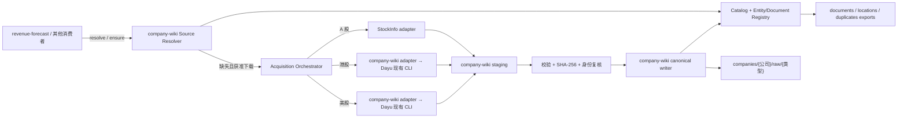

# 统一来源复用、内容去重与下载路由设计

状态：设计已实现（CW-2.2 → CW-2.24/2.28 + portfolio reuse 落地；由 resolver/ensure 下载前复用、三市场路由、duplicate 组标记与 duplicate_recycle 实现；2026-08-07 核验）  
日期：2026-07-18

## 1. 决策摘要

company-wiki 成为公司原始资料的唯一 canonical owner 和唯一落盘者。StockInfoDLSimple 与 dayu-agent 只负责发现和传输，所有下载先进入 company-wiki staging；校验、SHA-256、语义身份解析、去重、最终路径、manifest、索引和解析任务均由 company-wiki 决定。

核心规则：

1. 查索引在先，下载在后。已有满足实体、文档类型、报告期、版本和信息截止日要求的资料时，直接返回已有 `document_id/source_id`，不发起文件下载。
2. A 股缺失资料路由到 StockInfoDLSimple；港股路由到 dayu HKEX downloader；美股路由到 dayu SEC downloader。A 股不再同时走 dayu CN lane。
3. 文件名不是身份。内容 SHA-256 用于识别相同字节；监管公告 ID、HKEX DOC_ID、SEC accession number 和规范化报告身份用于下载前复用和识别字节不同的同一报告。
4. `SourceManifest v1` 保持不变。它继续表示内容 blob 与某个仓内位置；语义文档、版本、重复关系和下载回执由新增的版本化合同承载。
5. 重复只标记，不自动删除、覆盖或硬链接历史文件。后续若要压缩副本，必须是独立、可审计且经用户批准的操作。
6. LLM 不参与 SHA-256、强身份键或是否跳过下载的最终判定。LLM 只可在空闲 worker 中补元数据、提出低置信度重复候选、规范化和摘要。

## 2. 现状与问题

当前 catalog 已按 SHA-256 聚合同字节文件，但重复关系只隐含在多个 location 中，索引没有清楚显示“哪个是 canonical、哪些是额外副本、为什么重复”。实库只读统计显示：

- 20,422 条 document；
- 3,461 个 active original 的字节完全重复组；
- 3,492 个额外 original 副本；
- company raw 与 Dropbox Stock 之间有 3,400 个 exact-content 重复组；
- company raw 与 dayu portfolio 之间有 10 个 exact-content 重复组。

`location_count` 不能直接当作重复数，因为 dayu bundle 的 metadata、processed 文件也属于 location。另有相同空 JSON sidecar 被错误合成一个跨实体 document 的样本，说明“内容 blob 身份”和“语义文档身份”必须分层。

项目目录说明也有历史冲突。运行中的架构、运维手册、collector、StockInfo 与真实资料主要使用 `companies/{公司}/raw/{类型}`；另有说明称新 PDF 放公司根目录。本设计冻结前者为新的 canonical 写入规范，同时继续只读扫描两种历史布局。

## 3. 所有权与边界



边界约束：

- Dropbox Stock、dayu portfolio 与其他历史目录永远只读；扫描器只记录 location，不移动或改写它们。
- StockInfo adapter 只能写入 orchestrator 为单次请求创建的 staging 子目录；Dayu 现有 CLI 只能写入本项目通过 `--base` 分配的隔离临时 workspace。
- company-wiki 是唯一可写 canonical raw 和 catalog 的组件。
- dayu 不与 company-wiki 共享可变数据库；若 dayu 后续需要文件，由 company-wiki 提供只读路径或版本化 export。
- company-wiki 只管理来源、解析、证据位置和资料检索，不生成投资评级、估值或研究结论。

## 4. 身份模型

身份必须拆为六层：

| 层 | 主键/强键 | 含义 |
|---|---|---|
| `Entity` | `entity_id` | 规范公司/证券实体；维护名称、旧名、ticker、CIK 等 alias |
| `Document` | `document_id` | 语义文档家族，例如“某公司 FY2025 年报” |
| `DocumentVersion` | `version_id` | 原版、修订版、不同语言版或重新发布版 |
| `ProviderRecord` | `(provider, provider_document_id)` | CNINFO 公告 ID、HKEX DOC_ID、SEC accession 等官方记录 |
| `SourceBlob` | 当前 SourceManifest `source_id=sha256 URN` | 不可变原始字节 |
| `Location` | `location_id` | 某个 blob 在某个 root/path 的物理位置与角色 |

`AcquisitionRequest/Attempt` 另行记录一次查询、发现、下载、复用或失败过程，不把运行状态塞进不可变来源对象。

### 4.1 规范化文档身份

强 provider ID 优先：

- A 股：`cninfo:{announcement_id}`；StockInfo adapter 必须从发现链接或接口响应保留公告 ID；
- 港股：`hkex:{doc_id}`；
- 美股：`sec:{cik}:{accession_number}`。

跨 provider 或历史文件没有强 ID 时，使用高置信度语义键：

```text
entity_id
+ document_kind/form_type
+ report_period_end 或 fiscal_year/fiscal_period
+ language
+ scope（full/summary、consolidated/standalone）
```

`published_date`、标题和文件名只能辅助，不能单独触发自动跳过。修订版属于同一 `Document` 下的新 `DocumentVersion`，不是应丢弃的普通重复文件。

### 4.2 实体别名

必须建立统一 entity registry，例如：

```text
entity_id: security:CN:SSE:688012
aliases: 中微公司, 中微半导体设备（上海）股份有限公司, 688012, 688012.SH
```

目录名仍可使用人类可读公司名，但 resolver 与去重一律使用 `entity_id`。名称变更、A/H 双重上市和同名公司不能靠字符串猜测。

## 5. 重复关系与索引展示

重复不能只有一个 boolean。定义以下关系：

| relation | 判定 | 自动处理 |
|---|---|---|
| `exact_copy` | 同一 `document_id/version_id` 且 SHA-256 相同，存在多个 original location | 复用 canonical；显式标记额外位置 |
| `same_document_variant` | 同一语义文档/版本关系，但 SHA-256 不同，例如交易所重新封装、修订版、语言版 | 全部保留；按版本关系选择默认读取版本 |
| `shared_blob_not_duplicate_document` | SHA-256 相同但语义 document 不同，例如空 sidecar、通用模板 | blob 可共享，document 不合并 |
| `possible_duplicate` | 只有标题、日期、文本相似等弱信号 | 进入审核队列；不得自动跳过或合并 |

精确重复组 ID 不能只用 `source_id`，否则相同空 blob 会跨语义文档误合并。建议：

```text
exact_duplicate_group_id = hash(document_id + version_id + source_id)
```

### 5.1 导出文件

现有 document index 增加或升级为下列字段：

- `document_id`, `version_id`, `entity_id`, `market`, `ticker`；
- `document_kind`, `form_type`, `fiscal_year`, `fiscal_period`, `report_period_end`；
- `provider`, `provider_document_id`, `published_date`, `amended`；
- `current_source_id`, `canonical_location`；
- `exact_original_copy_count`, `exact_duplicate_location_count`, `variant_count`；
- `duplicate_status`, `exact_duplicate_group_id`, `quality_status`。

另导出：

1. `locations.csv`：每个 root/path 一行，包含 `is_canonical`、role、状态和 canonical location；
2. `duplicates.csv`：每一对/组关系一行，包含 relation、match basis、confidence、review status；
3. `acquisition_attempts.csv`：记录 `reused_before_download`、`deduplicated_after_download`、`downloaded_new`、`ambiguous`、`failed` 等结果。

Markdown 索引可以显示简洁标签，例如：

```text
FY2025 年报 | canonical: company_raw/...pdf | 完全重复副本: 2 | 版本: 1
```

## 6. Resolver 与下载流程

### 6.1 请求合同

```json
{
  "schema_version": "1.0",
  "entity": {"market": "CN", "ticker": "688012"},
  "document_kind": "annual_report",
  "fiscal_year": 2025,
  "language": "zh-CN",
  "as_of_date": "2026-07-18",
  "allow_download": false
}
```

请求幂等键由规范化后的实体、文档类型、期间、语言、信息截止日和版本策略确定；不能包含临时路径或显示文件名。

### 6.2 下载前决策

resolver 按顺序执行：

1. 将名称/ticker 解析为唯一 `entity_id`；歧义时停止。
2. 按强 provider ID 或高置信语义键查现有 `DocumentVersion`。
3. 校验 source quality、原文件可用性、期间、语言、版本和 `as_of_date`。
4. 若满足，返回 `reused_exact` 或 `reused_equivalent`，不得调用文件下载。
5. 若本地资料可能过期，仅调用轻量 discovery 检查是否有新公告/修订；discovery 不等于下载。
6. 弱匹配只返回 `ambiguous`，不静默复用。
7. 确认缺失且 `allow_download=true` 时才进入 adapter。

`as_of_date` 是硬边界：为历史预测取数时，不能因为 catalog 里已有后来发布的修订版就越过信息截止日。

### 6.3 Adapter 协议

为隔离三个项目的 Python 环境和依赖，推荐由各 downloader 暴露稳定的 JSON CLI/服务协议，而不是 company-wiki 修改 `sys.path` 导入私有 workflow：

```text
adapter capabilities
adapter discover --request request.json
adapter fetch --candidate candidate.json --staging-dir <allocated-path>
```

标准 `DownloadCandidate` 至少包含：

- provider、adapter name/version；
- provider company ID、provider document ID；
- entity identifiers、market/ticker；
- title、source URL、source type；
- form/document kind、filing date、report period、language、amended；
- ETag、Last-Modified、remote size（若有）。

标准 `DownloadReceipt` 至少包含：

- request/candidate ID；
- HTTPS 原始 URL；
- staging 内相对路径；
- actual bytes、MIME/PDF magic、SHA-256；
- retrieved_at、HTTP status；
- adapter/tool trace 与版本；
- provider identity 与远端 fingerprint；
- validation status/error。

adapter stdout 只输出合同 JSON，日志写 stderr。传入 staging 目录必须经过 company-wiki 校验，adapter 不接受 canonical raw 或任意外部绝对目标路径。

### 6.4 下载后提交

1. 验证 staging 路径没有越界；
2. 验证文件非空、MIME/PDF magic、大小和可读性；
3. 在文件稳定期间计算 SHA-256；
4. 再查一次 provider ID、语义身份和 SHA-256，防止并发/重试造成重复；
5. 根据结果处理：
   - 已有同一 version + 同一 SHA：不复制；记录 `deduplicated_after_download`；
   - 已有同一 document + 不同 SHA：创建/关联新 version 或 variant；
   - SHA 相同但 semantic document 不同：共享 blob，分别保留 document；
   - 真正新文档：原子移动至 canonical raw，写 manifest/catalog；
6. 在同一 catalog 事务中完成 provider record、version、blob、location、receipt 和后续任务入队；
7. 事务成功后清理 staging；崩溃恢复时按 receipt 和 hash 幂等重放。

## 7. 市场路由

| 市场 | adapter | 需要的改造 |
|---|---|---|
| A 股 | `C:\Users\郑曾波\Projects\StockInfoDLSimple\v2-clean-rewrite` | 把 link discovery 提升为 typed candidate；保留公告 ID/URL/日期/期间；下载只写 staging；返回逐文件 receipt |
| 港股 | Dayu 现有 `python -m dayu.cli download` | Dayu 零改动；本项目组装公开参数，把 `--base` 指向隔离临时 workspace，再从公开 filing meta 读取 HKEX DOC_ID、原始 PDF、URL 与 SHA |
| 美股 | Dayu 现有 `python -m dayu.cli download` | Dayu 零改动；本项目组装公开参数，把 `--base` 指向隔离临时 workspace，再从公开 filing meta 读取 SEC accession、primary document、URL 与 SHA |

路由根据规范 security identity 决定。`market=unknown`、ticker 歧义或双重上市未指定证券时，不尝试多个 downloader 猜测，以免重复下载或归错公司。

## 8. Canonical 路径

新下载统一写入：

```text
companies/{canonical_company_name}/raw/{document_type}/{subtype}/
```

示例：

```text
companies/中微公司/raw/financial_reports/annual/
companies/中微公司/raw/financial_reports/semi_annual/
companies/中微公司/raw/financial_reports/quarterly/
companies/中微公司/raw/prospectus/
companies/中微公司/raw/research/
companies/中微公司/raw/investor_relations/
```

建议显示文件名：

```text
{published_date}_{provider}_{provider_document_id}_{safe_title}.{ext}
```

Windows 非法字符、保留名和长度必须确定性清洗。身份永远来自 catalog 字段，不从文件名反推。provider ID 缺失的历史文件保留原名，不做批量改名。

## 9. revenue-forecast 集成

`revenue-forecast` 技能本身是取数治理和预测计算框架，不应内置 downloader。集成点应放在它的 host research/capture layer：

```text
resolve_source(request) -> SourceHandle
ensure_source(request) -> SourceHandle | AcquisitionJob
```

`SourceHandle` 返回：

- company-wiki `document_id/version_id/source_id`；
- content SHA-256、canonical path、MIME；
- publisher、原始 HTTPS URL、published/retrieved date；
- provider identity、collector/adapter trace；
- locator/解析状态与 quality；
- `reuse_reason` 和信息截止日检查结果。

行为约束：

1. 默认只调用 `resolve_source`；
2. 确认缺失后才由 host 调用 `ensure_source`；
3. `ensure_source` 必须经 company-wiki market router，不允许技能直接写自己的 output/workspace；
4. capture receipt 绑定 company-wiki 的同一 SHA-256 snapshot，而不是另存一个“技能副本”；
5. revenue forecast 的 claim 继续绑定 `source_id + locator + snapshot hash + as_of_date`；
6. 预测 artifact 留在下游，company-wiki 只保存原始来源与解析证据。

这满足技能的数据治理要求，同时消除“技能每次运行都重新下载一份财报”的行为。

## 10. Canonical 选择与版本策略

canonical location 采用确定性优先级：

1. company-wiki 自有 verified raw；
2. 官方 provider 且元数据完整的来源；
3. 完整报告优先于摘要；
4. 对“当前资料”请求，已验证的最新修订版优先；
5. 对历史 `as_of_date` 请求，只在截止日前可见版本中选择；
6. 路径优先级仅用于展示，不改变 blob 或 document 身份。

“摘要版”和“完整版”、不同语言版、修订前后版都不能当成可删除的 exact copy。原始版本保留，默认读取版本通过 version relation（`amends`、`translation_of`、`summary_of`、`repackages`）表达。

## 11. 后台运行与资源控制

现有 Windows worker 的 start/pause/resume/stop 与登录自启动机制继续作为统一控制面。新增 acquisition queue 遵循：

- `resolve` 为快速只读操作，可随时运行；
- 自动 coverage discovery 与下载只在 AC 电源、系统空闲且 worker 未暂停时执行；
- revenue-forecast 的显式 `ensure` 可同步等待，也可只入队；
- downloader、catalog writer 和 LLM 均保持单线程顺序执行；
- 下载与 LLM 使用独立预算/限速；pause 不再领取新任务，stop 可安全结束当前 staging 后退出；
- 默认不为了“可能有更新”批量重下，只做轻量 discovery 和 identity 对比。

## 12. LLM 的正确角色

MiniMax M3、MiMo 2.5 Pro 等配置模型可在空闲阶段：

- 从标题/正文补全报告期、类型、语言等 metadata candidate；
- 对没有 provider ID 的历史文件提出 `possible_duplicate`；
- 生成规范化 Markdown、摘要和 EvidenceSpan 辅助信息。

但以下内容必须是确定性逻辑：

- SHA-256、byte size、路径越界与 MIME 校验；
- provider 强 ID 匹配；
- exact duplicate 标记；
- `as_of_date` 过滤；
- canonical 提交和幂等事务。

LLM 提出的语义重复在未通过规则或人工审核前不得导致跳过下载、合并 document 或删除文件。

## 13. 分阶段实施

### Phase A：索引可见性（company-wiki）

- 保持现有 `sources` 表兼容，把它明确视为 blob；
- 增加独立 document/version/provider/duplicate/acquisition 表；
- 先用现有 SHA-256 生成可靠的 exact duplicate 关系；
- 更新 document/location/duplicate export；
- 不移动或删除文件。

### Phase B：实体和报告身份回填

- 建 entity/alias registry；
- 从 dayu metadata、路径和文件名回填市场、ticker、form、期间与 provider ID；
- 低置信度只产出 `possible_duplicate`；
- 对空 sidecar 等样本拆开 blob 与 semantic document 身份。

### Phase C：Adapter 合同与 dry-run

- 冻结 `DownloadCandidate/DownloadReceipt` JSON schema；
- StockInfo 实现 JSON command adapter；company-wiki 的 HK/US native adapter 调用 Dayu 现有 CLI 并映射其公开 filing meta；
- company-wiki 只执行 discovery 和 resolver dry-run，验证不会写外部 root。

### Phase D：query-first 接入 revenue-forecast

- 在 host capture layer 接 `resolve_source`；
- 加入“已有文档时 downloader 调用次数为 0”的强制测试；
- capture receipt 绑定 company-wiki source hash 和 locator。

### Phase E：受控下载

- 先单公司、单报告期 shadow/canary；
- 验证 staging、崩溃恢复、下载后二次去重；
- 再启用 A/HK/US 路由和后台缺口队列。

### Phase F：可选空间治理

- 仅生成“可清理副本清单”和预计节省空间；
- 必须用户审核后才允许移动到回收站/归档；
- 不属于本设计的默认实施范围。

## 14. 跨项目改动清单

company-wiki：

- schema migration 与 versioned contracts；
- entity resolver、source resolver、acquisition orchestrator、canonical writer；
- explicit duplicate exports 和 CLI/API；
- staging/recovery/idempotency；
- worker queue 与控制面接线。

StockInfoDLSimple：

- `DownloadCandidate` discovery API；
- 公告 ID、URL、日期、期间等 provenance；
- staging-only fetch 和逐文件 receipt；
- 删除“同名文件即已存在”作为主要跳过规则，改由 company-wiki resolver 决策。

dayu-agent：

- 不修改任何源码、测试、文档或配置；只调用已有 `python -m dayu.cli download` 及公开参数；
- `--base` 指向 company-wiki 管理的单次临时 workspace，`--config` 只读指向现有 Dayu 配置；
- company-wiki 不解析人类可读 stdout，而是读取 CLI 生成的公开 filing `meta.json`，映射 HKEX DOC_ID、SEC accession、primary file、URL 和 hash；
- 不导入 Dayu 私有 workflow，不写 Dayu 长期 workspace；导入 company-wiki staging 后清理临时 workspace。

revenue-forecast host/capture layer：

- 调用 company-wiki resolve/ensure；
- 禁止直接下载到技能 output；
- receipt/claim 复用 company-wiki source identity。

## 15. 必须通过的验收测试

1. 不同文件名、相同内容、同一报告：一个 blob/document version，多个 location，索引显式显示 exact duplicates。
2. 相同空 sidecar、不同 filing：共享 blob，但 document 不合并。
3. 相同报告、修订前后字节不同：一个 document family、两个 version，不误删。
4. 目录已有 FY2025 年报时，revenue-forecast resolve 成功且 downloader 调用为 0。
5. 只有弱标题相似时返回 ambiguous，不自动跳过。
6. A/HK/US 缺失时分别只调用指定 adapter 一次。
7. 下载后发现 SHA 已存在时不产生第二个 canonical 文件，但保留 acquisition receipt。
8. `as_of_date` 早于修订版发布日期时，不返回未来版本。
9. adapter 试图写 staging 外路径时 fail closed。
10. 中途崩溃后重放同一 request，不产生重复 raw、location 或 receipt。
11. 扫描、下载、规范化与 LLM 期间，Dropbox/dayu 外部 roots 的 metadata/hash 均不变化。
12. pause/stop 后不领取新下载或 LLM 任务；resume 后幂等续跑。

## 16. 本轮不做的事情

- 不删除、覆盖、移动或批量改名现有原始文档；
- 不运行 StockInfo/dayu 的真实下载；
- 不改变 SourceManifest v1；
- 不让 revenue-forecast 保存第二份原始财报；
- 不把“同一年度、标题相似”直接当成确定重复；
- 不把投资分析结果写入 company-wiki。
