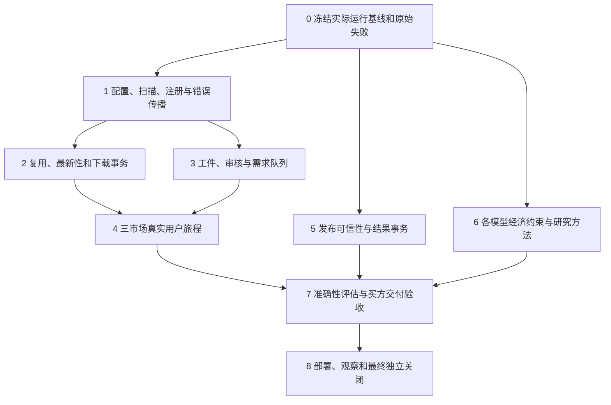

# 后续实施计划：按用户结果关闭三项目缺口

状态：**待实施，本轮不修改产品代码**。本版已合并第二波独立审查意见。它定义未来工作的顺序、边界、证据和退出条件，不是历史 PASS 的重新签发，也不创建定时任务、不启动 worker、不发布研究结果。

执行细化版：用户要求提高较弱模型可执行性后，已新增[执行包v2](execution_v2/START_HERE.md)及[逐卡调度表](execution_v2/dispatch.md)。本文件保留18项原义务；未来按子卡执行，不能直接把整阶段交给模型自由发挥。v2增加固定输入/oracle、专业决策门、失败接续与独立验收；它的文档检查不代表弱模型产品实施试验已经通过。

## 执行原则

- 以一次可观察的用户旅程为交付单位。优先演进现有入口，不新建第四套策略、状态机或审计框架。
- 每项同时保存原义务、获准范围变更、实际实现范围与未做后继。缩小范围可以是合理决策，但不能把被移走的需求标为已实现。
- fixture、真实代码跨进程、生产配置副本、真实只读数据、真实 provider、生产写入分别记录，不能互代。
- 复用既有测试和修复。已取消的投资研究 writer、冗余 markdown producer、存储迁盘、已退役旧链不因历史有空框而重建。
- 先准备可审查的变更、隔离验证和恢复方案，再处理确需生产写入的变更窗口；现有授权范围明确的只读和可逆工作继续执行。
- 保留现有用户 dirty files。破坏性测试仅在隔离副本；不在主 checkout 用 checkout/reset/stash 恢复试验。

## 工作顺序与依赖

阶段 5、6 可在不修改共享契约时与阶段 1–3 并行；同一配置、catalog writer、公共 schema 和输出 registry 只能有一个实施 owner。审查者不代替实施者写产品修复。

下表补齐共用负责人及恢复规则；具体人员在开始实施时指定。所有回滚必须恢复到记录中的版本与状态，不用“关闭严格门”充当回滚。

| 工作项 | 实施负责角色 | 独立验收与恢复边界 |
|---|---|---|
| I-00 | 三仓集成负责人 | 独立审计者复核；只在隔离副本改验收器/活动文档，保留原失败与历史档案 |
| I-01—03 | company-wiki来源系统负责人 | filing/revenue消费者复核；恢复配置/loader，保留已取得raw与journal |
| I-04 | filing-fetch负责人 | 独立并发/预算审查；恢复自身版本，保持进入scope前的用户暂停意图 |
| I-05—06 | wiki producer及revenue消费负责人，共享写入单owner | 另一代理观察实际读/写/调用；退回旧可用版本，保留不合格工件状态，禁止补假回执 |
| I-07 | 独立真实场景验收者 | 实施者不自签；失败保留样本和原始日志，不换公司或删副本造绿 |
| I-08—09 | revenue发布负责人 | 独立签名/故障注入审查；使用隔离registry，恢复上个完整已提交包 |
| I-10—11 | 定量模型与定性研究负责人 | 独立买方研究审查；模型/参数版本化，保留旧结果，不覆盖已发布快照 |
| I-12—13 | 独立评估与买方交付负责人 | 冻结样本与规则；指标不改善可退回基准，不删除失败样本或换评价口径 |
| I-14—15 | 测量与存储维护负责人 | 独立运维/恢复审查；停止有问题维护路径，保留备份，不进行未经验证清理 |
| I-16—17 | 部署负责人、独立终审者分别承担 | 验实际加载版本和自然运行；退回上一已验证组合，恢复原worker状态，未完成资格继续阻断 |

## 0. 冻结实际运行对象，保留可重放失败

**I-00：基线与证据清点。** Owner：三仓实施负责人；独立 reviewer 复核。

1. 记录三个 repo 的 commit、dirty 路径及文件 hash；保留用户修改，不要求通过清理主树获得“干净”。隔离 worktree 必须有独立依赖定位。
2. 记录实际技能入口、解释器、安装副本、配置路径、环境白名单、可执行模块路径。常驻进程另记加载版本、启动时间、配置指纹；worker 继续保持当前 paused，直到另有实际运行需要。
3. 冻结生产配置的安全副本、policy/adapter registry/flags、样本身份和文件 hash；使用 SQLite 一致性只读 snapshot，不能用活跃 WAL 数据库的单一字节 hash 替代一致性。
4. 收齐 9/18 紫金矿业年报复用、小米/微软新原件、CN 403、scan report、source preparation 错误的原始日志。执行者须使用原样本 ID，不能按名称猜路径。
5. 将本轮已成立反例变成未来变更前的回归输入，保留原调用方式和失败原因。不能靠修改输入接口使旧失败攻击面消失。
6. 修正现有验收器的判定依据：READ10 指向无关 artifact 测试、197 个 passed 缺 tier/输入/oracle、旧 PASS 遮住新 FAIL、空 commands/invariants、CA206/301/302 缩范围均应使相应业务完成判断失败。沿用既有工具修正，不另建一套状态框架；原义务和后继未完成状态必须参与计算。
7. 清理活动文档入口的时代歧义：AGENTS、CLAUDE、SKILL、README、DEPLOYMENT、OPERATIONS、使用说明书标明现行 owner/入口和已退役研究 writer。保留历史记录，避免代理照旧指南重启 writer、移动 raw 或无条件 resume。

退出：每个失败可以定位代码、配置、样本和实际入口；无法重放的外部失败保留原始证据并明确限制。冻结基线，并在隔离副本修正现有验收器与活动文档；上述反例必须阻断相应完成判断。此阶段不改生产raw/catalog/worker。

## 1. 先关闭“原件在磁盘但索引不可用”

**I-01：配置能力与运行时开关一致。** Owner：company-wiki。

1. 对每个启用 root 检查 effective route、adapter/profile/version、读写权限、kind、canonical target 与运行时 flags。允许的组合需有单一规则来源。
2. doctor 和真正 scan 使用相同解析结果。生产 config 副本缺 adapter、unknown adapter、合法第五根、只读根写目标、半激活状态都必须得到可解释结果。
3. 增加真实配置形状的正例和缺字段反例；不要从一个已经补好所有字段的新 fixture 推断生产可用。
4. 在副本中验证三真实根及一个此前未命名的同构 root。config-only 只承诺已支持的 adapter/profile；未知布局应明确不支持。

退出：当前失败组合被 doctor 提前识别，修后配置副本可实际 scan/resolve；未知 layout 不被错误放行。回滚：独立配置/loader 提交和 policy snapshot，不能删历史 assertion。

**I-02：扫描失败和注册状态真实传播。** Owner：company-wiki canonical writer / service。

1. 检查 scan receipt 的完成状态、每根错误、文件计数和目标文件处理结果；不以函数正常返回代替扫描成功。
2. 将 fetch、原子原件保存、索引注册、assertion 资格、最终 resolve 分别记录；下游保留上游 error code/retryability/request ID。
3. 用已下载的小米和微软原件在隔离 catalog 验证恢复注册；不重复请求 provider。
4. 注入 scan error、DB lock、错误 identity、断电边界；成功原件保留并可幂等重试注册，不能返回伪可信 handle。

退出：首次保存后能得到可验证注册结果；失败可定位阶段，第二次仅重试缺失阶段。原件、sidecar 不被猜测改写。回滚：关闭新注册入口并保留可恢复 journal，不删除原件。

## 2. 复用、最新性、授权和错误恢复

**I-03：GapPlan 语义。** Owner：company-wiki；filing-fetch 只消费。

1. 定义 period、财政年、revision、amendment、provider ID、披露/接受时间的优先规则；不能以 accession 字典序替代修订新旧。
2. 缺 period、同期间冲突、较早发布日期但不同 provider ID、新披露未来文件分别有明确判定。
3. 计划 hash 包含所有改变下载对象与资格的字段，包括 URL/版本/日期及 policy；变更后旧授权失效。
4. 对已有覆盖、分散多根覆盖、新期、更正版、provider 空结果和 provider 失败分别测试；失败不是“无缺口”。

退出：本轮四个隔离反例均被纠正，原有正确覆盖/零下载不回归；日期语义覆盖 CN 年报/半年报、HK 和非日历财政年。

**I-04：filing-fetch 预算、并发和错误信封。** Owner：filing-fetch。

1. 全过程使用单一 deadline；每次子调用返回后、退避 sleep 前重算剩余预算，不强行再给最小 10 秒。请求预算与必要清理预算分别定义并报告。本轮 10→14 是模拟时钟的 9 秒调用加 5 秒旧预算退避，未来用受控真实延迟与结构化 elapsed 同时验收。
2. worker lease/refcount 使用原子更新和明确所有权；两并发 acquire/release 不丢 PID，不重复首个暂停，不提前恢复。
3. 保存嵌套错误的结构和 retryability；不截断 JSON 后再包装成另一种不可重试错误。
4. 下载后失败仍保留真实下载/写入次数及已有资产，避免错误结果看起来“什么都没做”。
5. 首次缺失、已有复用、下载中断、注册失败、重试恢复、两请求并发采用实际 CLI。真实 provider 测试单列；hermetic 数量不能覆盖 deselected live。

退出：期限实测不越界，并发收支对账，CN 403 与本地契约错误可区分，第二次不会重复下载已有有效原件。回滚：仅自身实现，保持当前 worker 暂停策略。

## 3. 接通审核、工件与补料，保留严格证据门

**I-05：producer/consumer 契约。** Owner：company-wiki + revenue-forecast。

1. 检查 producer 默认写入的 schema、来源 hash、generator/version、created_at、状态和路径；消费方同一字段只能有明确权威位置。
2. 按实际语料列 normalized、summary、sections 与 consumer_analysis 的适用性；不重建已判冗余的 catalog markdown producer。
3. `selected_roles`、`recompute_plan`、`artifact_read_events`、`producer_invocations` 分开。artifact INSERT 是产物事件，不能代替失败重试在内的 LLM/parser 调用计数。
4. section 查询必须验证当前源、artifact 状态、版本、hash 和 span；旧 failed/missing/stale 记录不能因已经存在而阻止正确重算。
5. 失效按 DAG 最小传播；summary 变化不盲目重解析 PDF，原件变动必须使所有旧绑定不可用。
6. 实际读取与生成证据针对消费者需要的角色集。只需原文的工作不强制 summary/sections/LLM；不适用和材料不足明确返回，不能为了齐全而制造派生物。

退出：真实产生的合格工件经默认 bundle 路径消费；每个适用角色都有实际读取证据。无效角色被拒且说明恢复动作，不通过人工填绿色绕过。

**I-06：审核与需求队列真正可达。** Owner：revenue source-preparation / company-wiki review writer。

1. 在合理阻断前登记可执行的需求和证据缺口；重复请求幂等，不把未审原文标为安全。
2. 明确审核方法、输入 bytes hash、reviewer/工具版本、结果和失效条件；变更源或审核策略后旧回执不可用。
3. 队列消费后生成真实 review/producer 结果，再从原用户入口恢复。独立验证不只是“队列 helper 能返回 dict”。
4. 正例从未手工预填 review 的新样本开始；负例有注入命中、缺资料、审查失败和部分工件。

退出：一次请求得到完成结果或可执行缺口；补齐后原请求可继续并二次复用。不能通过取消审核门或生成虚假 not_detected 达标。

## 4. 三市场和跨根真实验收

**I-07：固定矩阵 + 新样本轮换。** Owner：独立验收者，三仓配合。

| 维度 | 必验情况 | 核心判据 |
|---|---|---|
| 市场 | A 股、港股、美股 | 身份、证券代码、财政期、provider 路由正确 |
| 文件状态 | 已下载已索引；已下载未索引；确实缺失 | 前两者零重复下载；第三者授权后完整注册 |
| 来源 | companies-only、dayu-only、外部目录-only、多根同 bytes | 唯一来源资格由 hash/location 验证；多根不冒充only |
| 工件 | 有效、缺失、版本过期、内容篡改、不适用 | 实际读取/最小重算/明确拒绝；预算来自事件 |
| 请求 | exact、latest、新修订、混合期间、重复和并发 | 无未来信息；只补真正缺口；二次完整复用 |
| 配置 | 安装入口、生产配置副本、合法第五root | 不依赖未声明 sibling 路径或手工替参 |
| 故障 | provider失败、scan失败、DB锁、进程中断 | 原始错误保留，可恢复，不报假成功 |

首批沿用紫金、小米、微软以验证修复；另选未在 fixture 名称中出现的公司和文件做独立泛化。没有真实外部唯一合格样本就记该格未完成，不能删除其它副本制造排他性。

每次从安装态 revenue 用户入口启动，记录三仓真实进程与具体模块，并将结果交给 forecast 输入准备。终点是合格收入预测输入及可用产物，不只是 resolve 返回 handle。真实下载需在明确目标和现有授权范围内执行；本文件没有启动这些动作。

## 5. 发布可信性与整体原子性

**I-08：可信签名声明。** Owner：revenue publication。

1. 普通文件存在不代表 attestation provider 能力；实际执行/调用可信提供者并验证回执与被签载荷。
2. `host_signed` 必须存在有效签名、受信 key/issuer、载荷 hash 和版本绑定；缺失、伪造、重放均拒绝。
3. 保留当前已修 F01/F02 输入验证和顺序，不重复重写。

**I-09：结果包与 registry 一致提交。** Owner：revenue publication。

1. 在输出写失败、registry 失败、第二文件失败、进程中断各边界证明结果包和 registry 不会产生可消费的半发布。
2. 定义 prepare/commit/recovery 或等效最小事务协议；读者只能见完整已提交版本。
3. 重复同一发布的语义明确；独立区分允许的审计历史多行与重复正式发布。

退出：本轮普通文件伪能力和 registry 先写反例均失败关闭；正确签名与正常发布继续成功。只在 scratch registry 上做注入，不能污染正式研究记录。

## 6. 逐模型提高经济解释和行业/生命周期覆盖

**I-10：31 模型逐一处置。** Owner：定量研究实施者；另一个买方研究 reviewer。

以 [model_ledger.jsonl](reviews/revenue/model_ledger.jsonl) 的每个现有模型为最小单位，不仅按下表几大类签收。每项补：适用行业/阶段、收入确认公式、单位、允许范围、来源字段、驱动独立性、确认时滞、硬约束、不可识别参数、拒绝条件、正/负例和至少一份实际披露映射。

| 模型族 | 需要专项检查的经济约束 |
|---|---|
| 矿业、能源、制造 | 权益产量与合并收入、内销抵销、回收/品位/产能、销量与产量、库存、价格与汇率；royalty率和金额单位不可混用。payability只能扣一次，明确在上游payable量还是商业条款扣；TC/RC分别注明干矿石/含金属/应付金属的数量基数 |
| 订阅、软件、云 | 客户 cohort、留存/净扩张与新增不重复计数、seat/usage/价格、合同负债/RPO确认节奏、渠道总额净额 |
| 平台、电商、广告 | GMV/交易数/客单价/take-rate 的独立证据、商户补贴、代理净额、广告load与价格、内容/商业化约束 |
| 消费、零售、餐饮 | 门店 cohort、同店增长、开关店与爬坡、渠道库存、出厂和终端销售、价格/组合与数量桥 |
| 订单/项目/资本品 | backlog质量、取消/重复订单、交付能力、验收与里程碑、收入确认和现金回款分离 |
| 银行、保险、REIT等 | 适用会计收入定义，利息与资产/息差、保险服务与保费不能互代、租金/出租率/到期租约与处置 |
| 前收入、生物科技及新业务 | 达成里程碑概率与时点、审批/产能/渠道前提、成功后规模；零基数不用无意义CAGR |
| 多业务、并购、重组 | 原口径重述、有机/并表/汇率分桥、内部交易抵销、分部生命周期不同、集团增量加总 |

生命周期独立覆盖前收入、起量、快速扩张、成熟、周期高低点、衰退、转型/重组。同一行业可能使用多个生命周期模型；不能把直接增长率模板视为每类企业都有充分覆盖。新增模型只有在现有公式无法表达必要经济约束时才做。

**I-11：定性研究进入具体参数。** 每条核心论点保留来源、管理层目标、历史兑现、竞争机制、替代解释、反证阈值和观察指标，并映射到具体 driver/情景。主动记录管理层乐观偏差、渠道冲突、客户集中、产能瓶颈和资本约束；不以泛化 moat 评分直接加收入增速。

退出：每模型有独立公式/单位 oracle 与实际披露映射；每条主增长论点有可证伪参数路径。人工判断和信息不足明确标记，不伪造精确置信度。

## 7. 用真实历史评估准确性，而非测试数量

**I-12：冻结预测 vintage 的评估库。** Owner：定量评估者，与模型实施者分离。

1. 固定每个 as-of 可获得的原始披露版本、发布日期、重述口径和预测 horizon；防止用后来实现值或后见分部重述参与当时拟合。
2. 按市场×行业×生命周期×预测期限建样本和排除理由；先小规模可审查试点，再按有效样本量扩展，不承诺不足样本的行业准确性。
3. 使用滚动起点评估和时间留出；与不增长、历史季节性、简单趋势及当时管理层指导等合适基准比较。
4. 同时报收入规模加权误差、绝对误差/偏差、分部增量误差、方向/拐点命中、区间覆盖率与宽度；零/负/微小分母不强用MAPE。
5. 情景低中高若没有概率校准，不称统计预测区间；若赋概率则评估校准和适当评分，防止任意放宽区间换命中率。
6. 拆分误差来源：数据/口径、数量、价格、组合、确认时点、并购/汇率及不可预见事件；保留失败样本，不只挑成功公司。
7. 用配对样本与不确定性范围判断改进，达不到证据强度就报告“尚未证明优于基准”。
8. 区分当时实际保存的预测与今天用历史资料重建的拟样本外预测；重建试验不能声称当时已做出该预测。单独列访问日与当时信息可得日，不倒填capture时间。
9. 预先冻结样本、参数估计、模型选择及评价规则，留一段未用于调参的时间测试集；覆盖退市/失败企业或明确排除理由，避免幸存者偏差和31模型事后选优。

**I-13：买方交付审查。** 不看实现者总结，检查是否能回答：未来收入增量来自哪里、最重要三项假设是什么、市场或管理层隐含什么、哪些证据会推翻判断、上下行情景是否受到物理/商业约束、下一份披露如何更新。给出年/季度路径、桥接、敏感性、缺口和跟踪触发点，避免用大量门禁字段代替研究结论。

退出：有真正经过 source-preparation→建模→验证→发布链的可审查研究包；准确性结论受数据证据约束，不由97 tests或主观confidence推出。

## 8. 部署、持续观察和独立关闭

**I-14：测量系统先测自身。** 校验 SLO 子进程返回码与业务输出；在进程存活时采 RSS/峰值。将采样窗口与命令总耗时、quick_check 耗时分开。登录30/60/120秒按同一锚点调度；缺截图/UI证据不能由事后事件补成即时通过。日志脱敏须验证实际异常出口，不能只测独立 redaction helper。

**I-15：安全维护缺口。** 对 section 选择、精确归档集合 prune、恢复、暂停/继续只做受影响的隔离测试。prune 必须绑定具体已验证归档集合，而不是只看到过期目录就删除所有 retired spans。当前不进行生产清理；历史磁盘迁移取消决定保留。

**I-16：部署与当前组合验证。** 安装同步、实际模块加载、生产配置、运行时 flags、迁移版本一起记录。真实新文件摄取、已有复用和失效重算在同一组合验证。需要 worker 时才在具体运行窗口恢复，并确认加载新版本；部署失败回到上一可验证配置，保留原件与历史记录。

**I-17：自然观察和终审。** 连续周期按真实时间积累，不用重复fixture报告、未来时间或不同命令时长凑足。独立 reviewer 从原用户需求逐条检查全部必要场景，而不是从 accepted 数量出发。已退役目标、合理不适用和未验证分别列出；有阻断项不能出整体完成结论。

终审须重新运行 I-00 的现有验收器反例。部署、自然观察和真实公司缺口不能只写在备注里却继续解锁对应业务完成节点。长期运行资格只约束相应上线/持续服务承诺，不把普通本地只读查询人为挂在全部长周期门之后。

## 每项最小证据包

沿用现有目录格式可行时直接扩展，避免再造复杂框架。最少包含：原义务与行号/hash；本次代码/config/安装/加载版本；输入样本与as-of；实际入口和环境；完整stdout/stderr；**raw_returncode、expected_returncode、判定三者分离**；关键输出/调用/读写事件；独立oracle；正反例与故障注入；恢复结果；reviewer结论和剩余缺口。

文件/hash存在只证明完整性，独立reviewer须读证据内容。产品结果、测试通过、历史证据充分性、未来计划状态分别记录。若审查发现本计划自身的漏项或判定错误，保留更正记录并重新审受影响范围，不为保持“全部通过”改写原始证据。
