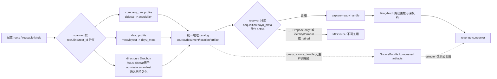

# 对抗性审查发现与证据台账

## 证据规则

- `事实`：由当前代码、配置、文件、测试或只读运行直接证明。
- `声明`：仅来自 README、计划、审计或 changelog，尚未由当前实现证明。
- `推断`：根据多项证据得出，必须明确写出推断链。
- 状态只使用：`已验证解决`、`部分解决`、`未解决`、`无法验证`、`历史项已失效`。

## 2026-08-08 追加硬需求：Dropbox 必须启用

- 用户明确要求：`C:\Users\郑曾波\Dropbox\Stock` 不得继续被排除，必须加入 filing 复用范围；实现优先级为 **配置-only**，只有现有配置表达能力经 RED 测试证明不足时，才允许提出最小代码变更并重新征得授权。
- 计划含义：原 WU-2 不能默认先建设新的 RootPolicy 代码；必须先走“配置能力探针 → 双侧配置修改 → 隔离/真实只读验收”的 config-only 快车道。
- 安全边界不变：Dropbox 必须启用不等于允许所有 `directory` 根，也不等于 broker report/任意 PDF 可被当作 filing；成功 handle 仍需 official filing kind、active、strong identity、capture-ready、路径 fence 和 provenance。
- 当前配置能力复核：`CatalogConfig` 的复用授权主键确实是 `reusable_root_kinds`，resolver 会把该 kind 的**所有 roots** 映射为 reusable root IDs；`RootSpec.kind` 又受固定 `ROOT_KINDS` 校验。因此 config-only 是否安全，取决于能否给 Dropbox 使用一个已经受支持、且没有其它不应复用 root 共用的专属 kind。
- 这意味着不能未经探针就把 `directory` 加入 reusable：那会把所有 kind=directory 的根同时放开。计划需先核对 `ROOT_KINDS`、当前所有 roots 的 kind 分布及 Dropbox 在 scanner 中对 kind 的行为；若已有专属受支持 kind，则配置-only 可行；若没有，用户“不改代码”的限制下只能选择受证明安全的现有 kind，不能伪造新字段或绕过 loader。
- 已核实当前 `ROOT_KINDS` 只有 `company_raw/directory/dayu_portfolio`，且当前生产配置中 **唯一** 的 `directory` root 是 `dropbox_stock`。所以现有 schema 下存在一条真正的 config-only 路径：company-wiki 把 `directory` 加入 `reusable_root_kinds`，filing-fetch 把 `${USER_PROFILE}/Dropbox/Stock` 加入 `allowed_handle_roots`；runtime 产品代码无需改变。
- 限制：这个路径的授权粒度仍是 kind，不是 root_id。它在“当前只有一个 directory root”时等价于只启用 Dropbox，但未来任何新增 directory root 会被自动放开。必须用配置契约测试固化不变量：`kind=directory` 的 root IDs 必须恰好为 `{dropbox_stock}`，否则 CI/doctor 失败。该测试属于测试/配置治理，不应改 runtime 代码。
- scanner 对 Dropbox 的 `重点关注` 子树已有 admission 规则；其它 Dropbox 子树仍按 legacy directory 逐文件、空 metadata 扫描。config-only 上线验收因此必须用真实 catalog 的只读候选审计证明：成功候选仅为 official filing 且满足 active/strong identity/capture-ready；若现有 resolver 的状态/谱系门使任何安全反例成功，配置-only 分支必须停止并报告 blocker，不能借用户授权顺手改 runtime。

## 初始发现

### F-001：三个项目均存在可用 CodeGraph 索引

- 类型：事实
- revenue-forecast：67 个 Python 文件、1329 节点、1506 边。
- filing-fetch：6 个 Python 文件、234 节点、283 边。
- company-wiki：345 个 Python 文件、7441 节点、12203 边。
- 影响：本轮可用 AST 图核验真实符号与调用关系；仍需用测试/运行证明行为正确。

### F-002：历史 planning-with-files 资产规模大且分散

- 类型：事实
- 三个项目根目录均已有 `task_plan.md`、`findings.md`、`progress.md`；revenue-forecast 另有 `audit_review`、`review_audit`、`AUDIT_REPORT.md`、`FILING_FETCH_AUDIT.md`，company-wiki 另有恢复版计划和专项验证计划。
- 影响：不能用最新 README 替代历史目标恢复；本轮工作文件必须隔离，避免覆盖历史证据。

### F-003：跨项目边界并非简单的三仓库串联

- 类型：事实
- revenue-forecast 有独立 `filing_fetch_client.py` 与 `company_wiki_source.py`；filing-fetch 只有 2 个实现文件；company-wiki 的 `source_catalog` 子系统则包含 acquisition、resolver、scanner、portfolio promoter、canonical writer、evidence/section query、worker 等完整链路。
- 影响：必须查清 filing-fetch 是权威编排层、薄适配器还是重复实现；若“复用”实际由 company-wiki 承担，计划需消除职责与配置双重来源，而不是只补 filing-fetch 局部测试。

### F-004：已有大量名义上的复用/下载抑制测试，但 E2E 身份尚未成立

- 类型：事实 + 待验证声明
- company-wiki 存在 `test_source_catalog_reusable_roots.py`、`test_source_catalog_download_suppression.py`、`test_source_catalog_cold_start.py`、`test_source_catalog_pipeline.py`、`test_source_catalog_cn_stockinfo_e2e.py` 等；filing-fetch 存在 `test_e2e_download.py`、`test_e2e_isolated_wiki.py`、`test_real_tool_conformance.py`。
- 尚未证明：这些测试是否贯穿真实用户入口、三个真实根目录的等价配置、真实索引存储、最新期判定、衍生物复用及零外部调用断言，也未证明进入 CI。
- 影响：本轮重点应审查断言与替身边界，不能按文件名计作覆盖。

### F-005：2026-08-03 前次审查并未判定项目完全达标

- 类型：历史声明，待按当前代码复核。
- 前次全量结果：revenue-forecast 253 测试全绿；filing-fetch 117 全绿（5 skip）；company-wiki 1629 绿、1 个 worker teardown 竞态失败；invest-core 36 绿（1 skip）；invest-framework 22 绿。
- 前次严重问题：F-02/F-11 为 Critical（弱验证/全哈希重签可伪造、trusted workflow attestation 伪完成）；F-01/F-04/F-08/F-10/F-12 为 High（receipt 顺序、旧 filing owner 双活、安装副本漂移、兼容矩阵、文档契约相反）；另有 hermetic、覆盖率、竞态、ruff 等 Medium 与客户端授权 receipt Low。
- 前次 filing-fetch 判断：reuse-first、identity、deadline、契约和 handle 深验证主体落地，但授权/gap receipt 未随 handle 返回；“实现存在”不等于本轮用户要求的三个目录和衍生物复用已被 E2E 证明。
- 前次计划要求：正式可信链、旧 owner 下线、安装同步、文档对齐、hermetic/worker/ruff 门等分阶段修复。当前仓库 2026-08-08 已新增大量代码/测试，必须逐项验证是否真正修复，不能沿用旧结论。

### F-006：2026-08-08 `review_audit` 再次发现“修复引入新漏洞”和伪完成

- 类型：历史声明，部分有当时动态探针证据，仍需核验当前 HEAD。
- 新 Critical N-01：嵌入 `input_document` 未与 `input_sha256` 绑定，攻击者可整体替换输入、重跑引擎并重签全部 hash，revenue 与 invest 消费链当时均接受；snapshot 因额外绑定会拒绝。
- 主要治理问题：Phase 10 标记完成但 `revenue_core.py` 曾增至 3922 行且抽取模块未接入；旧 filing owner 仅封 CLI、库级仍双活；trusted verifier 仍无 fail-closed；生产 source-catalog 配置曾被测试样夹具污染；安装副本再次漂移；coverage 阈值从原 90% 目标降为贴近现状；CI 未覆盖 ruff/coverage/sync/integration；E2E 范围窄。
- 当时实跑：revenue 280 绿；filing-fetch 117 绿、4 个 live 因生产配置污染失败、6 skip；company-wiki 1665 绿但 ruff 1 红。两个独立 E2E harness 均为真子进程/golden/双跑，但 revenue 仅单 fixture 引擎，filing-fetch 依赖相邻 company-wiki 且不覆盖真实生产三根目录。

### F-007：后续实施记录声称 R1-R9 基本完成，但计划镜像存在内部漂移

- 类型：文档声明 + 文档冲突。
- `review_audit/progress.md` 声称完成：输入锚点绑定、发布登记处、跨仓 conformance、attestation 签名、旧 filing owner 删除、config doctor/安装同步、计划声明校验、常态化对抗/mutation patrol、4.0.0/schema 3.7、文档对齐及真模块拆分；记录若干当时测试证据。
- `IMPLEMENTATION_PLAN.md` 顶部总览把阶段 0-10 标 `completed`，但正文多个阶段仍写 `Status: pending`，阶段 0 也同时出现总览 completed/正文 pending；该文件自称“进度镜像”却不自洽。
- 影响：即使 `verify_plan_claims` 存在，它未必检查 `IMPLEMENTATION_PLAN.md` 或跨文档冲突；本轮必须用当前代码、git、CI 与测试重建状态，不能把“completed”当结论。

### F-008：filing-fetch 的既有 E2E 重点是“临时 wiki 内复用”，不是用户要求的全局资产复用

- 类型：事实（测试设计文档/历史计划）。
- 隔离 E2E 覆盖 identify、capture-ready reuse、missing、partial provenance、损坏、身份、锁/暂停/超时等；下载 E2E 曾覆盖 CN/US/HK 与二次运行 mtime/journal 不新增下载。
- 2026-08-07 新 harness 特意改为 synthetic seeds，不依赖生产 `companies/`，并明确网络关闭、只覆盖临时 wiki；其价值是确定性，但不能证明本机三个给定目录已配置、已索引、可跨根复用。
- `test_e2e_isolated_wiki.py` 历史上仍依赖生产 seed，设计文档仅列为“候选改进”；需核对当前实现是否迁移。
- 因此现有 “E2E PASS” 不能回答：dayu/Dropbox 已有但 company_raw 没有时是否零下载、旧期+最新期是否只补缺口、MD/摘要是否复用。

### F-009：portfolio 自动提升方案已弃用，当前意图是 Strategy B 的只读跨根复用

- 类型：历史决策，待当前代码/配置/E2E 复核。
- 早期 `portfolio-reuse-fix` 只提供人工 promotion，被证明是“孤儿 CLI + 易被全局锁阻塞”，未满足自动用户路径。
- 随后的 Strategy A（ensure 前自动 promotion/copy）计划虽然标题各 Phase 标 completed，最终被明确弃用/回滚；当前目标改为 Strategy B：`CatalogConfig.reusable_root_kinds` + filing-fetch `allowed_handle_roots`，resolver 直接返回已索引 dayu portfolio 文档，零复制、零下载、加目录只改配置。
- 设计底线：外部根只读；company-wiki 为唯一 canonical writer；强 identity/kind/period/as_of/capture-ready 过滤；弱匹配 ambiguous；现有即复用，缺失且获授权才下载。
- 当前未知：Dropbox Stock 是否也列入两个白名单；配置值与扫描数据库是否一致；外部路径 handle 的深校验是否允许；索引陈旧/损坏时的行为；最新期 discovery 与衍生物复用是否存在。

### F-010：当前代码已具备 Strategy B 的核心钩子，但尚未证明生产闭环

- 类型：当前代码事实。
- filing-fetch `validate_handle(handle, request, wiki_root, allowed_roots)` 支持配置驱动多根路径 containment；省略时仍只允许 `company-wiki/companies`。
- filing-fetch `load_company_wiki_root` 接受 `allowed_handle_roots` 配置字段；需继续核对它是否实际解析、验证并传入 `resolve_filing` 的 handle 校验，以及配置是否列出三根。
- company-wiki scanner 对 `dayu_portfolio` 有专门 `meta.json` enrichment：form type → document kind、fiscal year/period、URL/provider/language/filing date、ticker/market；resolver 可从 catalog 形成 capture-ready handle。
- company-wiki resolver 现有测试符号包括：配置驱动 dayu 复用、默认排除、不在磁盘的陈旧文档不复用、capture 不全不复用、未来日期不复用、歧义不猜测。
- 风险：CodeGraph 搜索未发现 `reusable_root_kinds` 定义符号（可能为字段/配置而非可索引符号），需直接核验 `CatalogConfig`、resolver 过滤和实际 YAML/JSON；scanner 的分类仍含基于标题/关键词的弱推断，需要确认 admission/identity 是否足以阻止错配。

### F-011：衍生物资产已存在独立 section 提取/查询子系统，但未见 filing-fetch 契约消费

- 类型：当前结构事实。
- company-wiki 有 `extract_sections_catalog`、`SectionQueryService`、sections artifact role/version 与 section query schema；scanner 也会遍历多种文档扩展名。
- filing-fetch 的成功 handle 契约当前只要求原件身份、路径、hash、URL、日期、provider、capture trace 等，不包含 processed MD、摘要、section index 或 analysis artifact 引用。
- 初步推断：用户要求的“已处理过就利用”尚未形成跨项目可见契约；即便 company-wiki 内部已生成衍生物，revenue-forecast/filing-fetch 可能仍会从原件重读。需核验 evidence/section query 的实际调用者、freshness/lineage 字段和 E2E。

### F-012（高）：三个目录均在扫描配置中，但 Dropbox 被明确排除在 filing 复用闭环外

- 类型：当前配置事实。
- `company-wiki/config/source_catalog.yaml` roots 包含：`company_raw → company-wiki/companies`、`dayu_portfolio → dayu-agent/workspace/portfolio`、`dropbox_stock → Dropbox/Stock`。
- 同一配置的 `reusable_root_kinds` 只有 `[company_raw, dayu_portfolio]`；Dropbox 的 kind 是通用 `directory`，因此 resolver 不把其文档当可复用候选。
- `filing-fetch/config/company_wiki.json` 的 `allowed_handle_roots` 也只有 companies 与 dayu portfolio，不包含 Dropbox/Stock。
- 结论：就用户明确要求而言，当前实现至多满足“Dropbox 被扫描/索引的意图”，不满足“Dropbox 已有财报可直接复用”。这是双白名单同时缺失，不是单一配置遗漏；直接加 `directory` 又会把所有普通目录文档放开，需引入 root-id 级白名单或更精细可复用策略，避免把 broker research/任意 PDF 当监管财报。

### F-013：三根真实资产规模差异大，生产 catalog 已是重型状态

- 类型：当前文件系统事实。
- 初次使用遵守 `.gitignore` 的 `rg --files` 只看到 companies 36 文件，不能代表实际资产；改用不受 VCS ignore 影响的只读枚举后：companies 33122 文件 / 约 25.16 GB（15128 PDF、1073 MD、16524 JSON 等）；dayu portfolio 3651 文件 / 约 1.63 GB；Dropbox Stock 10317 文件 / 约 15.58 GB。
- company-wiki `.source_catalog/catalog.sqlite3` 约 49.27 GB，且后台 worker 正在持续更新；这意味着生产实测必须只读、限时、避免触发全库重扫或长期写锁。
- 风险：仅用 synthetic 小夹具无法暴露 49 GB catalog 下的性能、busy timeout、陈旧 location、分类噪音、跨根重复和索引时延；后续计划必须增加生产快照/采样式只读验收，而不是把真实库复制进常规 CI。

### F-014：生产 catalog 有衍生物/证据表，但根表不记录只读策略

- 类型：当前数据库 schema 事实。
- catalog 表包括 documents、locations、roots、artifacts、evidence_spans、source_metadata_assertions、scan_runs 等；`artifacts` 记录 document/source 关联、role、path、hash、generator name/version、status、metadata；`evidence_spans` 记录 locator/page/paragraph/table、parser name/version/status。
- `roots` 只存 root_id/path/kind/priority/last scan，没有 `read_only` 或 `reusable` 列；这两类治理依赖 YAML 和代码运行时过滤，数据库快照本身不能独立证明某 location 可否复用/可否写入。
- 影响：E2E 与审计报告必须把 config hash/version 与 catalog snapshot 绑定，否则“已索引”的 DB 证据可能被另一份配置解释成不同权限语义。

### F-015（高）：三根确实进了生产 catalog，但最近扫描持续 `completed_with_errors`

- 类型：当前数据库事实。
- roots 表确认三个绝对路径，最近共同扫描时间 2026-08-08 11:44:28Z；locations 中三根均有 active/retired 记录，故“应该都被 index 过”成立。
- 最近至少 10 次扫描状态连续为 `completed_with_errors`；可见首个重复错误是 Dropbox 中空的 `Product_Revenue_Forecast_Model.xlsx` 导致 `SourceManifestError: source file is empty`。
- 当前 locations：company_raw active original 7524 + active metadata 7508（另有大量 retired）；dayu active original primary 223 / attachment 284 / processed_docling 21；Dropbox active original 9200、retired 627、quarantined 1。
- 当前 documents 仅 29 active annual、6 active semi-annual、2 active quarterly、1 active regulatory filing；大量历史财报处于 retired，而 broker research/IR/other 为 active 主体。复用前必须解释 retire 策略与“最新财报”可见性，否则“索引过”仍可能 resolve 不到。
- 当前 artifacts 明确已有 normalized 约 4.6k、summary 约 2.47k、sections 11 等；但跨项目是否查询和 freshness 是否验证仍未知。

### F-016：现有测试资产覆盖“机制单点”，未形成用户关心的组合场景矩阵

- 类型：当前测试文字检索事实，断言深度待逐文件核验。
- filing-fetch 有 `allowed_handle_roots` 配置驱动 fence 测试；company-wiki 有 reusable roots、download suppression、canonical writer 二次零调用、URL re-enrich、artifact reconciliation、section extractor/query、LLM summary source binding 等测试。
- 未检索到直接命名覆盖：Dropbox root 作为 filing 可复用根；已有旧期但缺最新期只补缺口；同公司多期/修订版最新版选择；原件 + normalized MD + summary + sections 组合复用；consumer 端“解析/LLM 调用为 0”；索引陈旧后自动侦测/增量扫描；三个根同时有候选时的优先级/冲突处理。
- `test_source_catalog_worker.py` 中相同测试函数名在不同位置重复出现的信号，需要确认是否因 Python 后定义覆盖前定义而造成名义测试未收集。

### F-017（高）：filing-fetch 的“full-chain E2E”没有覆盖下载/补新，也没有覆盖外部复用根

- 类型：当前 E2E 代码事实。
- harness 只在临时 `companies/{entity}/raw/...` 写三份 synthetic 原件，然后通过真实 CLI 做 reuse-only；missing 场景只请求不存在年度并断言 `not_found`，未传 `--allow-download`，没有 adapter spy，也没有“补最新期”。
- 文件 docstring/设计说明称覆盖 “ensure missing” 或“full-chain”，但代码并未执行 authorized ensure；这是 E2E 名称/声明高于实际范围。
- harness 没有构造 dayu_portfolio 或 Dropbox root，没有测试两侧配置白名单，没有验证外部 root canonical_path 贯穿 resolver→filing-fetch→revenue consumer，也没有验证网络调用次数为 0。
- 计划要求：保留此确定性 smoke，但重命名为 reuse-only engine/CLI E2E；新增真正的多根离线 E2E 和受控下载补缺 E2E，避免一个 “PASS” 掩盖两类完全不同能力。

### F-018（高）：衍生物复用目前停在 company-wiki 内部，revenue 消费契约仍只认原件

- 类型：当前测试/契约事实。
- section 测试证明 artifact 写入、同 document 二次提取为 0、`--force` 重算、`SectionQueryService` 只读返回；artifact reconciliation 能检查 source/document/hash/role 并补登记。
- revenue `filing_fetch_client` 测试全部使用 fake script，只验证进程/错误传播；`company_wiki_source` 仅把原件 handle 转成 capture record，并重新读本地原件做 hash 校验。
- filing-fetch handle 和 revenue source record 均没有 `normalized_artifact`、`summary_artifact`、`sections/evidence_spans` 引用，也没有 generator/version/source_sha/freshness 选择逻辑。
- 结论：用户的第三点“已有 MD/摘要/分析要利用，不从头读取”当前没有跨项目闭环，至多是 company-wiki 内部具备可查询能力；需要新建 source bundle/query 契约，并以 consumer 端 parser/LLM 零调用断言验收。

### F-019：多根安全测试只验证局部 fence，尚无双配置一致性门

- 类型：当前测试事实。
- filing-fetch 单测验证 `allowed_handle_roots` token 展开与 path fence；company-wiki 单测验证 `reusable_root_kinds` 的 dayu 开/关和文件消失 guard。
- 未见测试把同一 root 同时写入 company-wiki reusable 配置与 filing-fetch allowance，再从真实 resolver handle 贯穿深校验；也未见“只在一侧配置”时 fail-fast 的 doctor。
- 当前双配置非常容易漂移，Dropbox 正是现实反例。计划应引入共享导出/派生配置或启动时一致性校验，并用一侧缺项/路径拼写错误/root kind 过宽的 RED 用例固化。

### F-020（高）：当前“复用优先”会跳过远端新版本发现，无法自动保证最新财报齐全

- 类型：当前代码事实。
- `AcquisitionCoordinator.resolve_or_stage` 在 resolver 返回任何 exact/equivalent reuse 时立即返回，adapter `discover` 调用为 0；只有明确请求的 period/year 在本地 MISSING 且 `allow_download=true` 才 discovery/download。
- 请求 schema 允许 `fiscal_year=None`，但 resolver 遍历所有同 kind 文档：多年度均满足时返回 AMBIGUOUS，不会选择“截至 as_of 的最新”；也没有 `latest`/revision policy、coverage gap 计算或“已有旧期→只补最新期”的批量语义。
- 因此系统只能复用/补齐“调用者已经准确知道要哪个年度”的单份文档。它不能从“我需要最新年报/最新季报”自动判断 catalog 是否落后，也不能在复用旧期同时发现并补新期。
- 计划需区分两条安全路径：历史快照请求继续严格零 discovery；current/latest 请求先做轻量 metadata discovery（不得下载），对 provider identity/修订号/发布日期做 gap plan，经授权只下载缺项。

### F-021（中高）：每次 resolver 都全量物化并线性扫描 catalog

- 类型：当前代码事实。
- `SourceResolver.resolve` 调用 `catalog.query(limit=10_000_000)` 后在 Python 层逐文档做 entity/kind/identity/year/date/root/handle 过滤。
- 在 49 GB catalog、约 20k documents 与大量 artifact/location JSON 聚合下，这会把单份 filing lookup 变成全库查询/物化，且 debug trace 可能为大量不匹配候选累积字符串。
- 当前单元/E2E 的小 catalog 无法揭示生产延迟、内存与锁竞争。实施计划需增加 SQL 下推/索引、候选上限、trace 截断与生产只读性能 SLO 测试。

### F-022（高）：section 查询 API 在生产代码中无调用者

- 类型：CodeGraph 结构事实。
- `SectionQueryService.list_sections` 唯一调用者是其契约测试；`SectionQueryService` 和底层 `extract_sections_catalog` 没有生产调用者（提取可能通过 `SourceCatalog.extract_sections`/worker 间接触发，但消费查询仍未接线）。
- 结论：已处理 section 资产即使存在，也不会自动流入 filing-fetch/revenue 用户路径；这是“能力存在、流程未接线”的同类问题，和早期 portfolio promotion 孤儿 CLI 具有相同风险模式。

### F-023：生产抽样显示“多期共存”和拒绝目录入库，进一步要求明确可见性/最新选择规则

- 类型：当前数据库只读抽样事实。
- company_raw 同一实体可有 2022/2023/2024/2025 多份年报，另有 2026 最新年报样本；当前 resolver 无 fiscal_year 时会对多份 semantic match 返回 AMBIGUOUS，而非最新。
- dayu_portfolio 的 active location 抽样包含 `filings/.rejections/...` 路径，documents 总表也有 189 条 `regulatory_filing/upstream_rejected`。尚需核验 `SourceCatalog.query` 是否排除非 active document；若未排除，配置放开 dayu root 可能把下载器明确拒绝的文件送入 resolver 候选。
- 文档表的 JSON 直接抽样没有读到预期 market/security/year/provider 顶层字段，说明关键身份可能存于 location/manifest 或查询层合并；计划中的生产验收必须从 resolver 的真实 query payload 检查，不可用单表存在性代替 capture-ready。
- 影响：root 复用验收必须覆盖 active/retired/quarantined/upstream_rejected、`.rejections`、多期、多修订、多 location 优先级，不能只用一份干净 fixture。

### F-024（高）：`SourceCatalog.query` 默认只隐藏 retired，未隐藏 quarantined/upstream_rejected

- 类型：当前代码事实。
- query 默认遍历 documents 全表，只对 `source_status == retired` 做隐身；`quarantined`、`upstream_rejected` 仍进入结果。
- resolver 没有再次检查 document `source_status`，只要求某 reusable root 下存在 active canonical original、identity/period/date/capture gates 通过。
- 生产 dayu root 已有 `.rejections` active locations 和 189 个 upstream_rejected regulatory filings，因此存在被错误复用的现实候选集；是否最终 capture-ready 需逐例验证，但设计门本身缺失已经成立。
- 必须新增 allowlist（通常只允许 active；明确的其它状态需专门策略）并固化 `.rejections`、quarantine、upstream_rejected、retired 四类拒绝测试及生产只读断言。

### F-025（中高）：通用 query 暴露衍生物路径时不校验完成状态、source binding 或当前 generator

- 类型：当前代码事实。
- `SourceCatalog.query` 将每个 document 的 artifacts 按 role 覆盖为一个 map，直接输出 `normalized_path`/`summary_path`；没有筛 `status=completed`、路径存在、artifact `source_id == document.primary_source_id`、source hash、一致的 generator/version 或 freshness。
- artifacts 表虽有这些字段，reconciliation 也能做部分核对，但读取热路径没有 fail-closed 选择器。
- 这解释了为什么不能简单把现有 `summary_path` 接给 filing-fetch：计划必须先定义 `ArtifactHandle`/`SourceBundle` 的完整性与新鲜度门，失败时回退到原件并明确记录原因，而不是静默重算或静默用旧结果。

### F-026（中高）：resolver 的性能问题比单纯 documents 线性扫描更严重

- 类型：当前代码事实。
- 每次 `SourceCatalog.query` 都全量读取 documents、document_entities+entities、locations+roots、artifacts、sources 五组表，在 Python 构建多张 map、为每个 document 标注 locations/duplicate，再在达到 limit 后停止；`limit=10_000_000` 等于完整物化。
- 即便目标实体只有一份年报，也会读取全部约 20k document 和数千 artifacts/locations；这是 production-only 性能风险，当前小 fixture 不会暴露。

### F-027（高）：company-wiki 的 planning-with-files 状态治理仍然失真

- 类型：文档内部冲突事实。
- `core-section-extraction/task_plan.md` 标“Phase 1–5 全部完成”，但 Phase 1–5 的任务框全部仍为 `[ ]`；完成证据主要在 progress。
- `catalog-space-remediation/task_plan.md` 标“Phase 1–6 全部完成”，但 Phase 5/6 标题仍是 pending，且其 Definition of Done 要求连续 4 周增长率受控；计划创建/宣称完成只相隔约一天，时间上不可能满足该门禁。
- 同一文档开头还保留“本方案只做规划与只读测算，不实施”的约束，后续 progress 却记录大量生产 apply/退役/归档/回收。
- 生产 DB 从历史 43.98 GB 增至当前约 49.27 GB，最近扫描连续带错误；这不直接否定治理收益，但证明“空间和一致性问题全部完成”至少缺持续验收证据。
- 结论：revenue 的 `verify_plan_claims` 没有覆盖 company-wiki 子计划/跨文档/时间门禁。本轮计划需把所有仓库和 `docs/plans/**` 纳入统一 claim verifier，禁止标题状态与 checklist/DoD/progress 冲突。

### F-028：章节能力实现了生产侧生成，却没有完成原始 Context 声称的消费方价值

- 类型：历史目标与当前结构对照。
- core-section 计划的 Context 明确说目标是供 invest/revenue/filing-fetch 研究使用，发现文档也指出 consumer 只能整篇读、需要 sections API。
- 实施完成证据只覆盖提取器、worker、CLI/SectionQueryService、真实三文档生成与 evidence span 关联；没有 revenue/filing-fetch/invest 消费接入和 E2E。
- 因此“功能代码完成”与“用户价值完成”被混为一谈。后续 DoD 必须以 consumer 跳过整篇重读/解析/LLM 的可观察调用数和输出 lineage 为准。

### F-029（高）：当前 CI 不能阻止多项已知问题复发

- 类型：当前工作流事实。
- revenue CI：pytest、单 fixture engine E2E、安装同步、mutation patrol、空/本地 publication registry audit；缺 ruff、compileall、coverage、`verify_plan_claims`、structure/release/drift 全门、跨仓真实 filing/source bundle E2E。
- filing-fetch CI：排除 `test_real_tool_conformance.py` 和 `test_e2e_download.py`，运行 companies-only synthetic reuse harness 与 sync；缺 ruff、coverage、真实三根/最新版/衍生物/受控下载门。
- company-wiki CI：只跑 unit+contract、CLI smoke、secret scan 和极弱 Markdown UTF-8 检查；缺 ruff、coverage、integration、acceptance、真实 e2e、config doctor、scan-health、production-snapshot contract。
- 先前 R4/R5/R8 记录声称的 config/plan/CI 防护并未完整进入当前 workflows。结论：本地实现或测试存在不等于未来回归会被阻止。

### F-030（高）：company-wiki 明确容忍重复测试定义，存在静默少收集

- 类型：当前配置 + 收集事实。
- `pyproject.toml` 对 `tests/contract/test_source_catalog_worker.py` 显式忽略 Ruff `F811`（重复定义）；文字检索已发现相同测试函数名在文件内重复。
- Python 模块加载时后定义覆盖前定义，pytest 只收集最终绑定，因此被覆盖的测试不会执行；忽略 F811 把这个风险制度化。
- company-wiki 当前收集 1670 tests，但数量本身无法发现被覆盖测试。计划需移除该忽略、先用 AST 唯一性检查列出所有重复定义并逐个重命名/去重，再冻结 collection manifest 变化理由。

### F-031（高）：取消局部豁免后确认有 11 组测试被后定义覆盖

- 类型：当前只读 Ruff 运行事实。
- `ruff check ... --select F811 --isolated` 在 `test_source_catalog_worker.py` 报出 11 组同名重定义，涉及 LLM summary source binding、列表边界、投资结论拒绝、单文档失败隔离、provider retry、MiMo fallback、dotenv 优先级、Windows startup/control 等。
- 这些不是单一无关 helper；其中多项直接覆盖 worker 可靠性、摘要可信性和启动治理。默认 pytest 的 1608 全绿不能证明前一组函数体被执行。
- 结论：这是确定的测试收集缺陷，不是代码风格偏好。必须在任何新复用功能之前修复，并检查两组函数体是重复拷贝还是存在断言差异。

### F-032：当前全量基线绿，但覆盖范围与用户验收存在明显断层

- 类型：当前运行事实。
- revenue-forecast：301 passed + 106 subtests（12.86s）。
- filing-fetch 离线/隔离集：115 passed、1 skipped + 27 subtests（55.58s）；本轮明确排除 real-tool conformance 与 download E2E，避免外部写入/下载。
- company-wiki unit+contract：1608 passed（362.56s）。
- 这些结果证明当前被收集的单元/契约基线稳定，不证明 Dropbox admission、latest gap、artifact consumer、真实下载或生产 49 GB 性能。把它们当发布验收会误绿。

### F-033（中高）：三仓静态质量不一致，revenue 模块拆分留下大量未清理导入

- 类型：当前只读 Ruff 运行事实。
- filing-fetch 的实际代码/测试/tools/E2E Ruff 全绿。
- company-wiki 配置口径除被隐藏 F811 外还有 1 个 unused `pytest` import；项目根全扫还会纳入历史 prototype 并产生更多错误，说明 lint scope 本身需要明确。
- revenue-forecast 对 `scripts tests tools e2e` 报 185 个错误，大量是模块拆分后遗留的 unused imports，另有 E2E/tool 小问题。功能测试虽绿，静态门不能宣称完成，CI 又没有 Ruff。
- 结论：历史“真模块拆分”在结构上成立，但代码清理和持续门禁未完成。

### F-034：Dropbox 可通过现有配置启用，无需修改 runtime 代码 —— 已被 WU-2A.0 探针证伪（2026-08-08 实施阶段修正）

- 原结论：类型为当前 CodeGraph + 配置事实，声称两处配置即可启用 Dropbox。
- **修正**：WU-2A.0 探针（`tests/contract/test_source_catalog_dropbox_probe.py`，真实 resolver 运行）证明两处配置是必要但非充分条件：
  - `scanner.py:1072-1077` 的 `document_metadata` 只在 `company_raw`/`dayu_portfolio` 根把 sidecar 元数据写入 `acquisition`/`dayu_meta` 嵌套键；`directory` 根两者均为 `null`（fixture 与生产 catalog 双重验证）。
  - `resolver.py:275-283` 的 `_source_metadata()` 只读 `metadata[“acquisition”]`/`metadata[“dayu_meta”]` → directory 根文档恒返回 `{}` → form_type/provider/market/security_id/source_url 全部缺失 → resolver 依次报 `form_type_mismatch`/`identity_unverifiable_strict`/`capture_incomplete`，无法形成 capture-ready handle。
  - 生产 catalog：dropbox root 下无 active 官方财报（annual 371/semi 128/quarterly 56 全 retired），唯一 active semi-annual 的 metadata 实际属 company_raw。
- **结论**：启用 Dropbox 复用需要最小 runtime 修改（scanner 对 dropbox 重点关注子树把 sidecar 元数据写入 `acquisition` 键，约数行），超出原 §2.4 “runtime 零改动” 授权范围；WU-2A.0 状态 = blocked，等待用户对最小 runtime 修改授权或调整需求。
- 保留有效部分：`ROOT_KINDS` 仅含三个 kind、dropbox_stock 是唯一 directory root、resolver 按 `reusable_root_kinds` 过滤、filing-fetch 支持配置化 `allowed_handle_roots`——这些配置机制本身成立；风险（kind 级授权连带放开未来 directory roots）与 CONFIG-DBX 契约测试需求仍有效，但须在 runtime 缺口修复后重新探针。

### F-035：昨日计划之后三仓已发生大规模实施，旧架构结论必须按当前 HEAD 复核

- 当前 HEAD：revenue `73a23c69...`、filing `2d9eb3b6...`、wiki `9b7e8565...`；相对原审查基线已有 WU-0/1/6/7/8/9 等多批提交。
- revenue 工作区另有正在进行的 closure-ledger/CI/audit 工具变更；wiki 有既存/进行中的日志、测试与 archive 变更。本调查不触碰这些内容。
- CodeGraph 当前可用；revenue 统计已变化，filing/wiki 统计与旧值相同，需按用户既有授权刷新后再做结构判断。
- 影响：F-034 已经证明“配置可以放开候选集合”不等于“目录文档携带 resolver 所需的统一 metadata/provenance”。本轮进一步调查这是不是单点漏写，还是 root-specific ingest 架构的系统性问题。

### F-036（架构核心）：catalog 统一了文件/位置表，却没有统一 filing 语义元数据契约

- 当前 catalog 在物理层确有 data-lake 雏形：sources/documents/locations/artifacts 分表、同 hash 跨 location 去重、root priority、active-only 默认查询、SourceBundle 都已存在。
- 但 filing 的语义 metadata 仍以 `documents.metadata_json` 内的 root-specific 嵌套形态存在。当前 `query_filing_candidates` 的 fiscal-year SQL 明确只读 `$.acquisition.fiscal_year` 或 `$.dayu_meta.fiscal_year`；这把“原始文件来自哪里”泄漏进了通用查询层。
- resolver `_source_metadata()` 同样只认识 acquisition/dayu_meta。即使第三种 root 成功被索引、文档类型也分类正确，只要 metadata 没装进这两个名字之一，provider/form/market/security/year/URL 就不可见。
- 结论：当前抽象是“统一 catalog + 两种受支持 ingest profile”，不是“任何已索引 root 都通过统一 metadata contract 成为等价数据源”。Dropbox 失败不是单一白名单问题，而是 semantic-normalization 边界缺失。
- 已实施的 WU-3.1/3.2/4/5 改善了状态过滤、SQL 性能、latest 和 artifact bundle，但没有消除上述 root-specific metadata schema；SourceBundle 位于更下游，无法修复 ingest 时丢失的身份/出处字段。

## 分维度验收结论

| 维度 | 有效成果 | 关键缺口 | 判定 |
|---|---|---|---|
| 设计 | canonical writer、external root 只读、reuse-first、强 identity、as-of/授权边界方向正确 | exact 与 latest 未分型；root 权限依赖双配置和 kind；artifact 信任契约缺失 | 部分解决 |
| 架构 | revenue 已物理拆模块；filing 是薄层；wiki 集中 catalog/acquisition | section/artifact 是 producer orphan；consumer 未接；root policy 双源；resolver 通用全表 API 被滥用 | 部分解决 |
| 代码质量 | 三仓测试大体稳定；filing Ruff 干净 | revenue 185 Ruff；wiki 状态过滤 fail-open、query 全量物化、11 个测试重定义 | 未达发布门 |
| 测试 | unit/contract 数量大；已有 reuse/download suppression/identity/section 局部测试 | 没有三根+latest+derived+consumer 组合 E2E；CI 排除下载/真实 conformance；无 parser/LLM 跨进程零调用断言 | 未解决核心验收 |
| 文档 | 多轮 planning 记录较丰富，可恢复历史决策 | completed/pending/checkbox/DoD 冲突；E2E 名称过度；IMPLEMENTATION_PLAN 镜像不自洽 | 未解决 |
| 实际用户体验 | companies/dayu 对明确 exact 请求具备复用基础；缺失且授权可走下载链 | Dropbox 不复用；不能自动识别最新缺口；已处理资产 consumer 不用；ambiguous/null-year；生产扫描持续 error | 未达到本轮期待 |

## 历史问题追踪矩阵

| ID | 原始要求/痛点 | 历史来源 | 当前实现证据 | 测试/运行证据 | 状态 | 后续实施项 |
|---|---|---|---|---|---|---|
| A-F01 | publication receipt 顺序/锚点 | 2026-08-03 audit | 当前 publication/anchor 模块仍在并有 structure/contract guards | revenue 301 绿；未单独重放所有历史 probe | 部分解决 | WU-1.3、WU-10 |
| A-F02 / N-01 | 可替换 embedded input 后重签 | 两轮 audit Critical | 当前 input_sha/input_document binding、adversarial/mutation 资产存在 | 当前相关测试随 301 通过；旧 owner 路径已移除 | 已验证解决（已知向量） | WU-7.2、WU-10 保持 mutation |
| A-F03 / N-08 | engine/schema/version 与文档漂移 | 两轮 audit | 当前记录称 4.0/schema 3.7；compat registry 存在 | 计划镜像仍自相矛盾 | 部分解决 | WU-8.2、WU-8.3 |
| A-F04 / N-03 | revenue 旧 filing owner 双活 | 两轮 audit High | CodeGraph 当前未见旧 `filing_acquisition.py` 生产 owner，边界转向 filing-fetch/company-wiki | revenue guard/全量通过 | 已验证解决 | WU-7.1 防回归 |
| A-F05/F12 | 文档与真实契约相反 | 2026-08-03 audit | 新文档有更新，但 filing E2E“full-chain”仍过度声明；计划状态冲突 | 无统一 docs/claim CI | 未解决 | WU-8.2、WU-8.3 |
| A-F06 | filing 测试不 hermetic | 2026-08-03 audit | synthetic temp wiki harness 已改善 | 115 离线绿；CI 仍 clone 相邻 company-wiki 浮动代码 | 部分解决 | WU-6、WU-7.1 |
| A-F07 / N-07 | coverage 目标和新增模块覆盖不足 | 两轮 audit | 有 coverage 脚本/局部阈值 | 当前 CI 不运行 coverage，新增关键链无 branch gate | 未解决 | WU-1.3、WU-7.1 |
| A-F08 / N-06 | 安装副本漂移 | 两轮 audit | 三仓有部分 sync/doctor 工具 | revenue/filing CI 有 sync，但跨仓/公司部署未统一 | 部分解决 | WU-7.1、WU-7.2 |
| A-F09 | company worker teardown 竞态 | 2026-08-03 audit | worker/teardown 测试扩充 | 本轮 1608 单次全绿，但无重复 stress；11 个 worker 测试定义覆盖 | 部分解决 | WU-1.1、WU-7.2 |
| A-F10 | 兼容矩阵不可信 | 2026-08-03 audit | publication/contract registry 已存在 | 当前常规测试通过；跨仓 CI 仍用浮动 sibling | 部分解决 | WU-7.1 |
| A-F11 / N-04/N-11 | trusted verifier/attestation 可伪完成 | 两轮 audit Critical | 后续加入 signature/provider/context/registry 防护 | 实现测试存在，但缺独立 host/release 端到端信任验证 | 部分解决 | WU-7.2、WU-10 |
| A-F13 / N-09 | company Ruff / CI 门缺失 | 两轮 audit | pyproject 反而对 worker 文件忽略 F811 | isolated Ruff 证实 11 重定义；CI 不跑 Ruff | 未解决 | WU-1.1、WU-1.2、WU-7.1 |
| A-F14 | 下载授权/gap receipt 未返回 client | 2026-08-03 audit | handle 仍缺授权/gap/latest bundle | 现有 E2E 未断言 | 未解决 | WU-4.2、WU-4.3 |
| N-02 | 模块拆分伪完成 | 2026-08-08 review | 当前 CodeGraph 显示独立 contracts/research/forecast/analysis 模块 | structure/301 绿；Ruff 185 显示清理未收尾 | 部分解决 | WU-1.2 |
| N-05 | 测试污染生产 source config | 2026-08-08 review | 当前三根配置看似恢复且有 doctor 工具 | CI 未执行完整 doctor；双配置现实漂移 | 部分解决 | WU-0、WU-2A.1/2A.5、WU-7.1 |
| N-10 | E2E 范围窄/名称过度 | 2026-08-08 review | 当前两个 harness 仍主要是单 fixture engine 或 companies-only reuse | 静态逐行确认不含 download/latest/external/artifact consumer | 未解决 | WU-6 全部 |
| P-Strategy-B | dayu 目录直接只读复用、零复制 | portfolio reuse plans | dayu 在 reusable kind 和 allowed root 中；scanner 有 meta enrichment | 局部 resolver/fence 测试存在，无跨仓真实 root E2E | 部分解决 | WU-2、E2E-R02 |
| P-Dropbox | 三个已索引目录都应复用；Dropbox 必须配置-only 启用 | 本轮用户要求 | 现状仍被排除；已证明现有 schema 可用两处配置启用且无需 runtime 改动 | 没有 Dropbox filing E2E | 未解决（方案已确定） | WU-2A.0~2A.5、E2E-DBX-01~10 |
| P-Latest | 旧文件复用并补最新 | 本轮用户要求 | exact 命中立即返回；无 latest policy/gap plan | 无测试 | 未解决 | WU-4、E2E-L01~L07 |
| P-Derived | MD/摘要/分析不从头读 | 本轮用户要求 + core-section plan | artifacts/sections/evidence producer 存在；consumer contract 无字段/调用者 | section query 唯一 caller 是测试 | 未解决 | WU-5、E2E-D01~D06 |
| C-Space | catalog 空间治理/持续增长受控 | catalog remediation plan | 大量 retire/cleanup 工具和历史 apply 记录 | DoD 的 4 周门不可能已满足；当前 DB 49.27 GB、扫描持续 error | 无法验证为完成 | WU-0.2、WU-7.2、WU-8.3 |

## filing-fetch 复用专项矩阵

| 场景 | 预期 | 当前代码证据 | 当前测试证据 | 判定 | 计划测试 ID |
|---|---|---|---|---|---|
| company-wiki 有 exact 原件 | 零 discovery/download、强 provenance | resolver exact reuse + company_raw reusable | synthetic harness 覆盖 temp companies | 部分解决；未证生产/consumer | E2E-R01 |
| 仅 dayu 有 exact 原件 | 直接只读复用、零复制/下载 | 配置/handle fence/dayu enrichment 已有 | 局部 contract，无完整跨仓 E2E | 部分解决 | E2E-R02 |
| 仅 Dropbox 有 official exact | 直接只读复用，runtime 零改动 | 当前两侧白名单均排除；config-only 方案已证实可表达 | 无测试 | 未解决（待实施配置） | E2E-DBX-01/02/10 |
| 三根同 hash | 确定主 location、保留等价谱系 | root priority/location 数据存在 | 无组合测试 | 无法验证 | E2E-R04 |
| 同期不同 hash/无 revision | ambiguous，不猜测 | resolver 有 ambiguity 基础 | 无三根冲突 E2E | 部分解决 | E2E-R05 |
| rejected/quarantined | 永不复用 | query 只排 retired，resolver 不复查 status | 无完整负例；生产有现实候选 | 未解决 | E2E-R06 |
| catalog 记录但文件丢失 | 判 stale，不返回 handle | resolver 有 path existence guard | 有局部测试 | 已验证解决（局部） | E2E-R07 |
| 本地只有旧期，未授权 | 旧期保留；发现 gap；0 fetch | 无 latest/gap 语义 | 无 | 未解决 | E2E-L01 |
| 本地只有旧期，已授权 | 仅下载最新有效缺口 | 只有 caller 已知 exact period 才能下载 | download test 不覆盖 gap | 未解决 | E2E-L02 |
| 本地已最新 | metadata verify 后 0 fetch | exact reuse 会 0 discovery，但不能证明 up-to-date | 无 | 未解决 | E2E-L03 |
| 新期尚未发布 | 不制造缺口 | 无 calendar/provider latest policy | 无 | 未解决 | E2E-L04 |
| 已有 valid normalized MD | consumer parser=0 | catalog 暴露未严验 path；filing/revenue contract 无字段 | producer idempotency 有，consumer 无 | 未解决 | E2E-D01 |
| 已有 valid summary | 对应 LLM=0 | artifact table有数据；无安全 selector/consumer | source-binding producer test有且部分被重定义风险影响 | 未解决 | E2E-D02 |
| 已有 sections/evidence | 不整篇读，保持定位 lineage | SectionQueryService 有但无生产 caller | query contract only | 未解决 | E2E-D03 |
| artifact stale/wrong source | 只重算依赖 DAG 受影响节点 | 通用 query 不校验 status/binding/version | reconciliation 局部，消费无 | 未解决 | E2E-D04/D05 |
| 无文件、无授权 | 返回 missing/gap，0 download | acquisition 权限门存在 | current missing smoke 覆盖 exact | 已验证解决（exact） | E2E-L01/F03 |
| 无文件、授权 exact | 下载一次、二次复用 | acquisition/adapter/canonical writer 存在 | download E2E 存在但不进 CI/本轮未运行 | 部分解决 | E2E-F01/F02 |

## 风险登记

| ID | 风险 | 概率 | 影响 | 当前证据 | 计划控制 |
|---|---|---|---|---|---|
| R-001 | indexed 被误当 reusable | 已发生 | 高 | Dropbox 被扫描但两侧白名单排除 | 两处 config + CONFIG-DBX-01~04 + E2E-DBX |
| R-002 | `directory` 放开后未来其它目录或 broker/任意 PDF 被当财报 | 高 | 严重 | 授权按 kind；Dropbox 内容混杂 | directory-root 集合锁 + admission/status/identity/capture-ready 负例 + canary |
| R-003 | 被 provider 拒绝的文件被复用 | 中高 | 严重 | query 不排 upstream_rejected；生产有 `.rejections` active location | WU-3.1 + mutation + production snapshot |
| R-004 | 有旧报告就误称“已最新” | 已发生的设计行为 | 高 | exact 命中即跳过 discover，无 latest policy | LatestPolicy/GapPlan/E2E-L* |
| R-005 | summary/MD 存在但错误绑定或过期仍被消费 | 高（若直接接线） | 严重 | query 直接暴露路径，不验 status/source/version | ArtifactHandle fail-closed + E2E-D04/D05 |
| R-006 | consumer 继续整篇解析/调用 LLM，用户感知不到复用 | 当前确定 | 高 | bundle 字段和生产 caller 缺失 | WU-5.4 + 跨进程调用计数 |
| R-007 | 49 GB catalog 查询延迟/内存/锁问题只在生产暴露 | 高 | 高 | 每次五表全量物化 + limit 10M | SQL pushdown + 100k benchmark + read-only canary |
| R-008 | 测试全绿但实际少收集 | 已发生 | 高 | 11 个 F811 被 ignore | unique symbol gate + collection manifest |
| R-009 | 双配置再次漂移 | 已发生 | 高 | Dropbox 双侧均缺；无一致性 doctor | 单一导出 + config hash fail-fast |
| R-010 | E2E 名称过度导致审计误判 | 已发生 | 中高 | full-chain harness 实际 companies-only reuse | 分层命名 + scenario registry + CI |
| R-011 | latest 查询未经授权变成隐式下载 | 中 | 严重 | 若在现有 coordinator 上直接加 discover 易混合 | metadata/fetch 分离 + GapPlan hash auth |
| R-012 | 外部根被写入/复制，破坏用户资产 | 中 | 严重 | 历史 Strategy A 曾做 promotion 后回滚 | read-only policy + before/after tree hash + writer fence |
| R-013 | plan completed 再次先于真实 DoD | 高 | 高 | 多份当前 plan 自相矛盾/时间门未满 | state machine + receipt + cross-doc verifier |
| R-014 | worker/扫描错误长期被绿测试掩盖 | 高 | 中高 | 最近至少 10 次 scan completed_with_errors | scan health SLA + target-aware degrade + timed gate |
### F-037（高）：`directory` 不是一个可插拔来源适配器，而是 scanner 内的弱语义兜底分支

- 类型：当前代码事实。
- `RootSpec` 只有 `root_id/path/kind/priority`，`kind` 又被封闭在 `company_raw/directory/dayu_portfolio` 三值枚举；配置 schema 没有 layout adapter、sidecar mapper、identity mapper、classification profile 或 admission-policy 引用，因而单靠配置无法描述一个新数据湖根目录“怎样从路径和伴随文件恢复 filing 语义”。
- `scanner._enumerate_root()` 按 `root.kind` 写成三套来源特定流程：`company_raw` 假设 `<company>/raw` 与 `*.source.json`；`dayu_portfolio` 假设 `<ticker>/filings/<filing-id>`、`meta.json` 和 SEC/EDGAR 字段；`directory` 仅逐文件扫描。
- Dropbox 的丰富处理不是由通用 `directory` 契约驱动，而是精确判断 `root_id == "dropbox_stock"` 且相对路径首段为中文硬编码 `重点关注`；对应 admission 正则、类别与侧车配对也写在产品代码里。该子树之外，`.source.json` 本身也会作为普通原件枚举，业务 metadata 为空。
- 通用目录的公司识别还依赖 `company_raw` 中存在 `<公司>/raw`，再以相对路径包含公司名且恰好唯一来反推 entity；因此“已被索引的任意目录”并不能独立贡献新公司、ticker/market/security_id 或消除名称歧义。
- `_classification()` 对 `directory` 的无匹配兜底是 `broker_research`，对 `dayu_portfolio` 的兜底才是 `regulatory_filing`；这证明根类型不仅描述物理布局，还隐式决定业务语义。`directory` 分支内部另有一个逻辑上不可达的 `if root.kind == "dayu_portfolio"`，是来源分支持续叠加留下的结构性异味。
- 结论：当前架构没有形成“增加根目录 + 声明适配规则即可接入”的 source adapter SPI；新增不同布局/sidecar 约定的数据湖根，通常需要改 scanner/admission/classifier，而不仅是配置。

### F-038（Critical）：Dropbox 侧车信息在扫描中被读取，却在 resolver 所依赖的规范语义层被丢弃

- 类型：当前代码事实；这是 config-only 不能成功的直接根因。
- 对 `dropbox_stock/重点关注`，scanner 会读取 `.source.json`，并用其做 admission、分类、标题/日期和 location manifest 构造；所以“索引看见了文件”和部分 capture provenance 并非完全缺失。
- 但写入 `documents.metadata_json` 时，scanner 只把 `company_raw` metadata 放入 `acquisition`，只把 `dayu_portfolio` metadata 放入 `dayu_meta`；`directory` 的 sidecar metadata 不进入任何 resolver 认可的语义容器。文档合并也只比较 `dayu_meta` 或 `acquisition`，Dropbox location 不能给同内容文档补齐这些字段。
- resolver 的 `_source_metadata()` 又只读取 `acquisition` 与 `dayu_meta`；`query_filing_candidates(..., fiscal_year=...)` 的 SQL 也只检查 `$.acquisition.fiscal_year` 和 `$.dayu_meta.fiscal_year`。这是“写入端与读取端共同封闭在两个来源 profile”形成的双重耦合。
- 因而即便配置把 `directory` 加入 `reusable_root_kinds`、再把 Dropbox 加入 filing-fetch 的 `allowed_handle_roots`，也只打开了“根可复用”和“路径围栏”两道门；market/security_id、form_type、fiscal_period/year、provider/provider_document_id、source_url 等仍可能为空，强身份、表单、期间、capture-ready 验证继续 fail closed。
- location manifest 中的 collector/retrieved_at/hash 不能弥补这一缺口：`SourceHandle` 的 HTTPS URL 与多数 filing identity 字段来自 `_source_metadata()`；verified assertion fallback 也只覆盖部分 market/security/fiscal-year，不能补 form/provider/URL/capture trace。
- 结论：Dropbox 的问题不是配置字段拼错，也不是“少一个白名单”这么浅；是采集层已有的语义没有被规范化并贯穿到解析契约。当前 negative probe 正确地在“仅启用 directory”后仍返回 `MISSING`，它暴露的是运行时契约缺口。

### F-039：下游的多根路径围栏已配置化，但它不是来源语义适配层

- 类型：当前代码事实。
- filing-fetch 的 `load_company_wiki_root()` 支持可选 `allowed_handle_roots`，`validate_handle()` 用这些根做 canonical path containment 与深校验；这部分能够通过配置接纳外部只读根，未把 Dropbox 字符串写死在核心调用链。
- 但 filing-fetch 并不扫描或解释任意根：它调用 company-wiki 的 `resolve/ensure`，只消费上游已经形成且 `capture_ready=True` 的 handle。`source_bundle` 在 filing-fetch 验证中是可选的前向兼容字段，且不能放松原 handle 的身份、hash、路径和 capture-ready 深校验。
- 因此 filing-fetch 的配置只能决定“上游给出的合格 handle 是否允许指向该路径”，无法把缺字段的 catalog document 变成合格 filing。把问题归咎为 filing-fetch 的单一白名单会混淆职责层次；主要阻塞点仍在 company-wiki ingest/normalization/resolver 契约。

### F-040：当前生产配置已经把 Dropbox 两道白名单全部打开；仍不能复用是反证，不是待配置事项

- 类型：2026-08-09 当前配置事实。
- `company-wiki/config/source_catalog.yaml` 当前为 `reusable_root_kinds: [company_raw, dayu_portfolio, directory]`，且配置了 `dropbox_stock -> ${USER_PROFILE}/Dropbox/Stock`。
- `filing-fetch/config/company_wiki.json` 当前 `allowed_handle_roots` 也已列出 companies、dayu portfolio、Dropbox Stock 三根。
- 因而“只需改两份配置即可启用”的机械步骤已经执行。若 probe/生产 catalog 仍不能返回 capture-ready Dropbox filing，逻辑上足以否定原 config-only 假设；继续改同类白名单不会产生丢失的 filing 语义。
- 风险：`reusable_root_kinds` 的授权粒度是 kind，不是 root_id。当前把 `directory` 打开意味着未来新增任何 `kind=directory` 根会自动取得复用资格；这与“只允许经过明确治理的数据湖根”的最小权限模型不一致。

### F-041：revenue-forecast 消费端大体根无关，但它只能利用上游已验证的 handle/bundle

- 类型：当前代码事实。
- `filing_fetch_client.resolve_filing()` 只启动 filing-fetch 并要求响应状态为 `capture_ready`；它没有 companies/dayu/Dropbox 分支，也不承担 catalog discovery。
- `build_revenue_source_record()` 对任意 canonical path 都会重算文件 SHA-256，并要求 capture-ready、HTTPS URL、published/retrieved/as-of 顺序、location/request identity；因此 Dropbox 若能产生同契约 handle，下游无需按根改代码。
- `select_reusable_artifacts()` 已能从 `source_bundle.valid_handles` 按 role 复用 verified normalized/summary/sections/consumer_analysis，且 consumer_analysis 可按 engine/model/prompt/input_bundle_hash fail closed。这是“已处理资产复用”的正确方向，也说明下游合同可以是根无关的。
- 但这些函数不负责把普通索引文件提升成 filing 或生成 bundle；它们依赖 company-wiki 正确规范化源文档并构造 bundle。因此当前泛化断点主要位于 ingest 与语义归一层，而不是 revenue 消费记录层。

### F-042（Critical）：生产 catalog 证明 Dropbox 是“已索引但没有独立可复用财报”的数据孤岛

- 类型：2026-08-09 对 49GB 生产 SQLite 的只读查询事实；没有触发扫描或写入。
- catalog 的 roots 正确登记三根：company_raw(priority 10)、dayu_portfolio(20)、dropbox_stock/directory(30)。Dropbox 有 9,828 个 original-primary locations（9,200 active、1 quarantined、627 retired）与 9,789 个 distinct documents，说明物理索引确实存在。
- Dropbox 关联文档中，官方财报分类为 annual 370、quarterly 56、semi-annual 129；annual/quarterly 全部 retired，semi-annual 128 retired，仅 1 active。
- 唯一 active semi-annual 并不是 Dropbox 独立提供的合格文档：同一 document 同时有 active company_raw 原件与 sidecar，`documents.metadata_json.root_id=company_raw` 且有 `acquisition`；Dropbox 只是相同内容的第二个 location。
- 以 Dropbox location 关联的官方财报中，103 个文档的主 metadata 来自 Dropbox（annual 47、quarterly 34、semi-annual 22），但它们全部 retired；其余多为与 company_raw 内容去重后的文档，也同样因 document status 不能进入 active resolver 候选。
- 全部 Dropbox 关联文档的顶层 JSON 都有 `acquisition/dayu_meta` 键，但大部分只是 `null`：仅 3,400 个因跨根同内容或主来源选择取得 acquisition object，dayu_meta object 为 0；`admission` 仅 17 个文档有记录。这解释了为何只检查“键存在”会产生虚假信心。
- 直接用户结论：今天的系统会把 Dropbox 中数百份看似财报的文件计入 catalog，却不能把任何 Dropbox-only 财报作为 active、强身份、capture-ready 的 filing 返回。`indexed` 在当前实现里不等于 `semantically admitted`，更不等于 `reusable`。

### F-043（高）：普通 directory 的关键词分类会制造“看起来像财报”的假阳性，说明不能把索引即复用

- 类型：当前代码 + 生产 catalog 样本事实。
- 一个 Dropbox 路径为“华创证券-汽车行业深度研究报告：海外汽车年报总结……”的 PDF，被分类为 `annual_report`、manifest source_type=`regulatory_filing`，但 entity 是 `unresolved:dropbox_stock`、published_date 为空、metadata 的 acquisition/dayu_meta 均为空。它本质是券商行业报告，不是公司监管财报。
- 一个“计算机行业2020半年报回顾……”PDF及其 `.source.json` 曾分别成为 `semi_annual_report` 文档；这同时暴露标题关键词先于语义身份、以及 focus 子树之外 sidecar 被当原件扫描的问题。
- 当前样本已因 location/document retired 而不会被 active resolver 复用，说明后续状态清理起到了止损作用；但它不修复 classifier 和 ingest 泛化，重新出现/新扫描的普通目录内容仍依赖其它门 fail closed。
- 对抗性结论：强身份、admission、capture-ready 门不是多余复杂度，而是阻止 data lake 噪音升级为正式 evidence 的必要边界；真正应泛化的是“如何规范化并证明语义”，不能把所有 indexed PDF 无条件当 filing。

### F-044：硬编码并非同一性质；需要保留写入所有权，拆除读取来源特例

- 类型：架构判断，依据当前调用点。
- 合理且应保留的耦合：`canonical_writer` 明确只写唯一 `company_raw` root，下载的新文件规范化进入 `companies/{entity}/raw/...`；这是单一 canonical writer、外部根只读与可审计 provenance 的所有权边界，不妨碍从外部根读取复用。
- 可配置且基本合理的耦合：filing-fetch `allowed_handle_roots` 路径围栏；它是安全授权，不解释业务语义。
- 不合理的读取耦合：scanner 用 `root.kind/root_id/重点关注` 分派 layout、sidecar、entity、classification 与 admission；resolver 和 SQL只理解 `acquisition/dayu_meta`；config 又没有 adapter/normalizer 声明能力。这些把“来源在哪里”与“文档是什么”绑在一起。
- 额外治理问题：CLI/focus cleanup 也把 `dropbox_stock/重点关注` 写成精确常量；这些专用清理工具本身可以接受特定 scope，但它们反向印证 Dropbox 尚未成为通用 source profile，而是一个嵌入主系统的专项例外。

### F-045（高）：`重点关注` 不是漏扫，而是被专用 admission 全部挡在 catalog 之外

- 类型：2026-08-09 文件系统、scan receipt 与生产 catalog 只读对照事实；修正初次仅看 0 行时的 freshness 假设。
- `C:\Users\郑曾波\Dropbox\Stock\重点关注` 当前真实存在，共 161 个文件（5 PDF、0 `*.source.json`、0 MD，其余主要是快捷方式/表格等）；生产 catalog 对该 prefix 确实为 0 location/document。
- 但 Dropbox root 最近扫描时间是 2026-08-08T22:54:12Z，晚于该目录内容；scan report 明确记录 `policy_excluded=82`。结合代码可知：focus 子树中每个受支持文件都先走 `evaluate_admission()`，不满足显式 kind/form/title 正则的文件直接计入 policy_excluded，根本不写 location。
- 因此 0 行不是“worker 没看见”，而是系统把这 161 个文件视为需专项准入的例外区域。没有 sidecar 的普通关注名单/研究材料多数被 fail closed 是合理安全结果，但这和“任何 index 过的目录都成为通用 data lake”并不是同一种产品语义。
- 仍有可观测性缺口：root 级 scan receipt 把三根汇总为 files_seen=46,499、policy_excluded=82，没有 per-root/per-prefix 的 admitted/rejected 原因分布；用户难以从“root 已扫描”判断某个目录为何 0 可用资产。

### F-046：专用 admission 改善了安全性，却进一步证明数据湖接入未抽象化

- 类型：当前代码事实。
- scanner 用 `root_id == dropbox_stock` 且路径首段等于 `重点关注` 才开启 sidecar 配对与 admission；其它 directory 路径继续 legacy 行为。策略本身包含中文/英文财报、SEC form、broker institution/report、IR/call/prospectus/announcement 等正则。
- 这套策略能阻止部分研报点评被标题中的“年报”误判，并对无充分证据内容 fail closed；这是必要的安全补丁。
- 但策略选择、规则与路径均在代码中，配置无法给另一个 indexed root 选择同一 profile，也无法声明不同 profile。其复用单位不是“通用 adapter + policy 配置”，而是一个精确命名的本机目录特例。
- 代码中的 `if root.kind == "dayu_portfolio"` 位于已经确定 `root.kind == "directory"` 的分支，永远不可达；这显示来源特例在单体 scanner 中累积，而非经明确接口组合。

### F-047（高）：现有 Dropbox probe 已准确暴露 blocker，但测试文件内部存在互相矛盾的成功声明

- 类型：当前测试代码事实。
- `test_probe_reused_exact_when_directory_kind_reusable` 的正文明确记录 KNOWN GAP：directory 加入 reusable kinds 后仍应为 `MISSING`，trace 命中 form/identity/capture 缺口；并说明 scanner 修复后才应翻转为 `REUSED_EXACT`。这是 config-only 不成立的最直接可执行证据。
- 但同一文件模块 docstring 仍声称“两份配置是唯一差异”“加 directory 后 REUSED_EXACT”“不需要 runtime edits”，与当前断言及已知根因相反。仅浏览测试标题/模块说明会得出错误结论。
- 更严重的是 broker negative test 尾部保留了一段标注“POST-FIX EXPECTED”的注释，建议未来把 broker document 对 annual request 改为 `REUSED_EXACT`；若弱模型照注释执行，将直接破坏该测试本应证明的隔离边界。这是复制粘贴留下的危险指令污染。
- 该 probe 还人为创建 `companies/ACME/raw`，让 `_infer_company` 成功；它没有覆盖“Dropbox 中有新公司但 company_raw 不存在”这个真实 data-lake 泛化反例。

### F-048：现有 config invariant 测试只能证明配置一致，不能证明功能可用

- 类型：当前测试代码事实。
- company-wiki 的 CONFIG-DBX-01/02 只断言 directory 已开启、Dropbox path/kind/priority 固定、且当前没有第二个 directory root；filing-fetch 的 CONFIG-DBX-03/04 只断言 allowed roots 恰为三根且 realpath 对齐。
- 这些测试能防配置漂移和 kind 级权限意外扩散，价值真实；但不会扫描 sidecar、不会运行 resolver、不会验证强身份/URL/form/fiscal period/capture-ready，也不会证明零下载。
- config doctor 用“禁止第二个 directory root”补偿 kind 粒度过粗，这是一条脆弱的全局不变量：它让未来新增数据湖根必须先改治理测试/模型，而不是在配置里逐 root 授权。这再次说明当前配置模型不具备自然扩展性。

### F-049：相关测试全绿，但绿色明确包含“Dropbox 合格财报仍 MISSING”这一已知缺口

- 类型：2026-08-09 动态测试事实。
- company-wiki 聚焦集合：Dropbox probe + config invariants + focus admission，共 21 passed；filing-fetch config/bundle compatibility 为 8 passed、1 skipped；revenue bundle artifact selection/E2E fixture 为 17 passed。
- 这些绿色结果证明当前实现与当前测试一致，而不是用户目标已达成。尤其 probe 把 config-only 后 `MISSING` 固化为预期，所以 CI 绿色会持续容忍核心 Dropbox reuse 缺口，直到测试被正确翻转。
- 正面覆盖：focus admission 有 announcement/commentary/broker 分类负例，sidecar pairing scope 也被锁定；SourceBundle 的下游选择和 forged bundle 不放松 handle 门已有测试。
- 缺失覆盖：没有一个跨三项目入口的绿色 E2E 能用 Dropbox-only、完整 sidecar、无 company_raw 副本的 filing 返回 capture-ready/零下载；也没有“新增第四个任意 layout root 仅改配置即可接入”的 adapter conformance。

### F-050：物理衍生物目录已经相当通用，但 Dropbox 财报因源文档不可解析而无法贯通消费

- 类型：生产 catalog 只读事实 + 当前消费代码事实。
- Dropbox 关联文档并非完全没有处理成果：artifacts 中有 normalized completed 1,782、summary completed 948、sections completed 7，另有 partial/unsupported。说明 artifact 表按 document/source hash 关联的方向具有 data-lake 特征。
- 但 Dropbox 关联的 official filing artifacts 全挂在 retired 文档上：annual normalized completed 126/summary 97，quarterly 12/6，semi 20/10；没有一个 active Dropbox-only official filing 能通过 resolver 带出 bundle。
- SourceBundle/consumer helper 的设计能够按 source SHA、artifact status/version/provenance 判定复用，而不是按 root 名称判定；其数据模型相对松耦合。
- 实际断链顺序是：source document 先因 status/identity/form/URL 等不能形成 handle，随后再好的 normalized/summary 也没有机会被 consumer 发现；此外 F-051 证明 bundle/helper 还没有接入生产调用链。

### F-051（Critical）：SourceBundle 与衍生物复用目前是“能力孤岛”，生产主链没有调用者

- 类型：CodeGraph 当前调用图事实。
- company-wiki 的 `query_source_bundle()` 调用者只有两个 contract tests；`build_source_bundle()` 的唯一产品调用者是这个无人使用的 query，其余调用者全部为 tests。
- revenue-forecast 的 `select_reusable_artifacts()` 调用者共 14 个，全部位于 `test_bundle_artifact_selection.py` 与名为 E2E 的 fixture 测试；没有生产 forecast/orchestration 调用者。
- filing-fetch 只允许 handle 携带可选 `source_bundle`，且明确 bundle 不得放松原 handle 深校验；company-wiki resolver 返回的 `SourceHandle.to_dict()` 本身不包含 bundle，也没有看到 CLI 在成功返回前调用 `query_source_bundle()` 注入它。
- 因而当前真实链路是“catalog 中有 artifacts + 有独立 bundle builder + 有 consumer selector 测试”，不是“用户运行 revenue-forecast 时会自动复用现成 MD/摘要”。这些组件尚未组成端到端功能。
- `test_bundle_e2e_d01.py` 的“E2E”命名容易夸大覆盖：它构造带 bundle 的内存 handle 并直接调用 selector，不能证明 company-wiki resolve → filing-fetch → revenue consumer 的跨进程主路径携带或使用 bundle。

### F-052（Critical）：为补 URL 而做的跨根“按公司名拼接”会破坏文档级 provenance

- 类型：当前代码事实与对抗性推断。
- scanner 会遍历全部 dayu `meta.json`，构造 `company_name -> source_url` 的单值 map；随后任何 company_raw sidecar 只要缺 URL，就按 company 目录名补入该 URL。
- 映射没有 document kind、form、fiscal year/period、provider document id、content hash 或 filing date 约束。同一公司有多期财报时，某一 dayu filing 的 URL 可能被赋给另一份 company_raw 文档。
- `mapping.setdefault(company_name, url)` 又取遍历中遇到的第一个 URL；代码未按 period/filing date 排序或证明唯一。即使文件 hash 仍正确，handle 的 `https_url` provenance 可能指向不同文件，且该 URL 恰好是 capture-ready 必填门。
- 这是为解决一个来源 profile 的缺字段而在 scanner 内直接读取另一个 root 的数据，属于横向紧耦合；它违背 data lake 中“每条规范化声明携带自己的 evidence/binding”的原则。
- 该风险与 Dropbox 同源：系统没有通用、文档级 identity join/metadata assertion 归一层，于是用 root 和 company-name 特例补洞。

### F-053（高）：实体识别把外部根从属化于 company_raw，无法成为真正通用湖区

- 类型：当前代码事实。
- `_company_names()` 只从 `kind=company_raw` 且含 `<child>/raw` 的目录生成公司词典；`_infer_company()` 只做相对路径子串匹配，并要求恰好一个命中。
- 因此 dayu 以外的通用 directory 若包含 company_raw 尚不存在的新公司，会成为 `unresolved:<root_id>`；多个公司名互为子串/同路径出现时也会 unresolved。sidecar 明明可带 `company_name/ticker/security_id`，当前 directory entity 推断却不以这些字段作为主证据。
- 测试 Dropbox probe 预先创建 `companies/ACME/raw` 正是为绕过这一限制；它没有证明外部 root 可独立贡献实体。
- 这使 company-wiki/companies 不只是“主要 canonical 存放地”，还隐性成为外部目录可识别性的主数据前置条件；与用户设想的多通用根、松耦合 data lake 有实质差距。

### F-054（高）：现有 URL enrichment 测试把未绑定的跨根补值固化为正确行为

- 类型：当前测试事实。
- `test_company_raw_sidecar_without_url_gets_dayu_meta_url` 明确让 company_raw PDF 与 dayu PDF 使用不同 bytes，然后只凭 company_name（fixture 的标题/日期碰巧相同）断言 URL 被复制成功。
- 测试没有制造同公司多期 dayu meta，没有断言 provider_document_id/fiscal-year/content hash 一致，也没有检查复制 URL 指向的 bytes 与 company_raw 原件相同；所以它验证的是“能补值”，不是“补值有正确 provenance”。
- 该测试会保护当前危险耦合，使简单重构或严格 identity join 可能先被判回归。需要把这类历史 gap workaround 与最终 data-lake contract 区分，而不能用绿测数量证明架构正确。

### F-055（高）：Dropbox 财报还被“缺 source_url”批量退休；白名单配置不会也不应自动复活

- 类型：生产 retire audit + 当前 scanner/resolver 事实。
- `document_retire_audit` 有 19,000 行：9,499 个文档在 2026-08-01 以 `legacy sidecar lacks source_url; batch governance Phase 15.6 (F13)` 退休，2026-08-07 又由 reconcile-retire 为同一批写入第二条审计；另有 2 个 placeholder。
- `metadata_json.root_id=dropbox_stock` 的 47 annual、34 quarterly、22 semi-annual（共 103 个）全部各有这两条审计，退休根因正是 legacy sidecar 缺 URL，而非 Dropbox 白名单关闭。
- scanner 明确把 retirement 设为终态：文件仍在磁盘且重扫可见时，只更新 last_seen，不恢复 document/location active。resolver 又只查询 active。因此修改 reusable roots/allowed paths 不会越过 lifecycle gate。
- 这是合理的 fail-closed 治理原则：没有可核验 URL/provenance 的文件不应自动作为正式 filing。但若要把它们纳入 data lake，需要逐文档补齐并验证身份/来源后走显式 restore/re-admission；绝不能用配置开关批量复活。
- 对用户构想的含义：data lake 应允许“不合格、待治理、可检索但不可作为 evidence”的资产状态；“被 index”不能等价成“可直接消费”。当前系统有状态门，但缺少一条通用、可配置、可审计的 metadata remediation/normalization 路径。

### F-056：dayu 的 config-only 成功不能外推到任意 indexed root

- 类型：当前代码与测试对照事实。
- `test_dayu_portfolio_reused_when_kind_is_config_driven` 确实证明：一个严格符合 `<ticker>/filings/<filing-id>/meta.json + primary_document` 约定、字段齐全的 dayu fixture，只需打开 reusable kind 就能 `REUSED_EXACT`。
- 原因不是 resolver 真正理解任意 root，而是 scanner 的第三分支已经完整写死 dayu layout：path parts[1] 必须为 `filings`、识别 `.rejections`、读取 group `meta.json` 和 entity `meta.json`、挑 selected/primary/PDF/HTML、构造 EDGAR URL、补 SEC/HK/CN identity、识别 docling attachment。
- 该分支写成 `else`，不是显式 `elif root.kind == dayu_portfolio`；由于 ROOT_KINDS 当前封闭才碰巧安全。未来若只把第四种 kind 加进枚举而未同步 scanner，它会被错误地当 dayu 解析。
- 所以配置开关对 dayu 是“启用一套已经由代码实现的 adapter”，对 Dropbox 普通 directory 只是“允许一个没有 filing normalizer 的弱语义根”。二者表面都在 reusable list，实际能力不等价。

### F-057：freshness/gap 算法本身基本根无关，问题仍在其输入集合

- 类型：当前代码事实。
- resolver 的 `latest_as_of` 在多个合格 handle 中按 published date/provider identity 选最新，没有 companies/dayu/Dropbox 分支；gap planner 也按 fiscal year、provider accession/amendment、as-of 对齐本地 handle 与远端候选。
- 这层可以实现“旧文件继续复用，同时发现缺期或同期间更新版”，设计方向符合用户要求。
- 但它的 local_handles 只来自已经 active、强身份、capture-ready、root-allowed 的 resolver 结果。Dropbox-only 文档在更早的 ingest/status/metadata 门被消失后，不会进入 gap planner，算法也无法知道 catalog 里其实有旧 PDF/摘要。
- 因而不能通过改 latest 算法解决 Dropbox；应该把合格源规范化与状态治理打通后复用现有 freshness 层。

### F-058：物理 catalog 是合格的数据湖基础，不应把结论简化为“系统全是硬编码”

- 类型：当前 schema/查询实现事实。
- catalog 已把 `roots`、按 SHA-256 唯一的 `sources`、逻辑 `documents`、多 `locations`、`entities`、`artifacts`、`evidence_spans` 分开；同内容文件能跨根共享 document/source，同时保留每个物理 location 和 manifest。
- canonical location 只在 active original-primary 中选择，按 root priority/root_id/path 稳定排序；其它同 hash locations 标为 exact_copy，不需要复制到 company_raw 才能表达重复。这一层符合多根只读资产湖的核心要求。
- source status、location status、retire/restore audit、artifact source hash/version gate、allowed path fence 等 fail-closed 机制也是正确的可信数据设计，而不是应移除的“耦合”。
- 真正的问题位于物理层之上的语义摄取：统一表并没有统一 metadata contract/adapter SPI。当前可概括为“一个通用内容寻址目录 + 两个硬编码 filing ingest profiles + 一个弱语义 directory fallback”。

### F-059：来源耦合高度集中在 scanner，而非均匀污染三仓；这使重构边界可定位

- 类型：当前代码结构与 literal inventory 事实。
- `_enumerate_root` 从 382 到 743 行，在一个约 360 行函数内同时实现 company_raw、directory/Dropbox、dayu 三种 layout；`_scan_catalog_impl` 又同时负责分类、entity、hash observation、document merge、状态与 location 写入。
- 样本 literal inventory 显示 root.kind/root_id、company_raw/dayu/dropbox、acquisition/dayu_meta 的来源特例主要集中在 scanner/admission/focus cleanup/resolver，filing-fetch 和 revenue consumer 没有相同规模的 root 分支。
- 好处是问题不是三仓无处不在：物理 catalog、handle fence、latest/gap、artifact validation 大多可保留。
- 坏处是 scanner 同时承担 adapter、normalizer、classifier、entity resolver、provenance enrichment 和 persistence；任何“支持新数据湖根”的改动都容易在同一函数里再加条件，弱模型也容易只修写入端或读取端一半。

### F-060：最终架构裁决——“物理数据湖已成形，语义数据湖未成立”

- 类型：综合判断，依据 F-034~F-059 当前代码、测试、调用图与生产只读数据。
- **config-only 最终裁决：当前不可能。** 两份配置已经启用 Dropbox；配置只表达 root/path/kind/priority/reusable 与 downstream path allowance，不能表达 sidecar/layout/identity/normalization/lifecycle remediation。失败发生在配置门之后。
- **战术修复与战略目标必须分开。** 把 focus sidecar 写进 resolver 已识别的 `acquisition` 容器，可能以很小 runtime diff 让现有 ACME probe 变为 REUSED_EXACT；但它仍以 Dropbox 路径特例复用 company_raw schema，不能支持任意新 root、新 layout、新 entity，也不解决 retired 资产、URL provenance、bundle 主链缺失。
- **用户关于紧耦合的直觉基本正确，但范围需校准。** 紧耦合不是整个三仓：它集中在 company-wiki 的 source ingest/semantic normalization。物理 catalog、内容寻址、跨根 location、handle 深校验、latest/gap、artifact validator 多数设计良好。
- **当前真实架构定义：** company-wiki/companies 是 canonical write store；dayu 是一个已实现的外部 filing adapter；Dropbox 是 generic directory + 一个硬编码 focus admission 特例；其它 indexed directory 是低信任 document lake，而不是可直接复用 filing lake。
- **data-lake 目标所缺的核心抽象：** root-id 级能力/权限；可选择的 source adapter/layout profile；统一 normalized filing metadata schema；字段级 evidence/binding/confidence；独立 entity resolver；admission 与 lifecycle remediation；adapter conformance；resolver 与 SourceBundle 的生产组装。

#### 耦合分级

| 类别 | 当前例子 | 裁决 |
|---|---|---|
| 必要安全/所有权边界 | company_raw 唯一 canonical writer；外部根只读；hash/identity/status/as-of/path fence | 保留 |
| 已配置化但粒度不足 | reusable_root_kinds、allowed_handle_roots、root priority | 可用但不能代表 adapter；root-kind 授权过粗 |
| 应抽象 | layout/sidecar pairing、metadata normalization、entity mapping、classification/admission profile | 当前是主要架构债 |
| 严重实现缺口 | directory sidecar 语义丢弃；resolver/SQL 只认两容器；bundle 主链零产品调用者 | 直接阻断用户目标 |
| 高风险 workaround | 按 company_name 从任意 dayu filing 补 company_raw URL | 需文档级 identity/evidence 约束 |
| 专项技术债 | 精确 `dropbox_stock/重点关注` 常量、focus cleanup、不可达 dayu 条件、测试注释自相矛盾 | 证明特例累积，需治理 |
