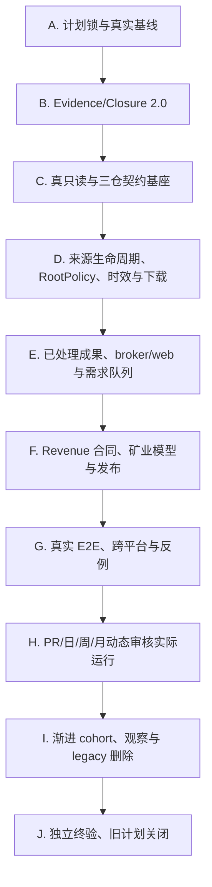

# 统一下一步执行计划

> 状态：计划已编制，产品实施未开始。  
> 适用范围：所有公司；紫金矿业为复杂真实 canary。  
> 权威性：根 [audit_review/README.md](../README.md) 是唯一控制面和任务游标；本文只提供A～J详细阶段边界，不能从本文自行领取工作。`completion_assurance_registry.md` 规定CA卡，冻结ZR注册表规定产品需求。

## 1. 计划组成与继承规则

本计划不复制、篡改仍可能被其他程序读取的旧文件，而以不可变 hash 引入已经详细编制的功能计划：

- 功能架构：`../2026-08-13_zijin_data_lake_remediation_plan/architecture_target.md`，冻结 SHA-256 `288995a9b9e4c2f6848fd28d35d6fc9297248f5fc674f18a61dc2ac79de34f6b`。
- 92 个产品工作单元：`../2026-08-13_zijin_data_lake_remediation_plan/work_unit_registry.md`，冻结 SHA-256 `72c70eb6df9bf9cd04e8a9e42ad795477da9c28f30db291d7b8d1dda3d5de709`。
- 102 个新增真实场景：`../2026-08-13_zijin_data_lake_remediation_plan/scenario_matrix.md`，冻结 SHA-256 `e08cbe4e93b933bd01bc758dcef5aeee194417bde0d23d05ea0bc011e03cac8a`。
- 弱模型 20 步手册：`../2026-08-13_zijin_data_lake_remediation_plan/implementation_runbook.md`，冻结 SHA-256 `b20a8b886261118a0b1449809f63db8de4f57f6099061115c9af8761c95ba132`。
- 旧 95 场景词汇继续 mandatory，来源 hash `21e9201296aa048bd61e1125525a0eadb8ac1deb5bed76a641f05b3099f1d3c5`。

这些文件是“只读功能规范 annex”，不是另一个可并行领取任务的计划。未来执行者只能从根 `audit_review/README.md` 的 `current_next` 领取工作；不得直接在旧目录推进状态。若任一 hash 漂移，立即停止并走 `CA-001` plan-drift 审核。

本次新增的 `CA-*` 工作单元修复旧计划最根本的验收、证据和关闭漏洞。所有 92 个 `ZR-*` 初始状态一律 `pending`；旧 accepted 不继承。某个 ZR 若当前代码已满足，仍须跑规定 RED/mutation/current-triplet/独立审查，随后可标 `already_satisfied`，不必无谓改代码。

## 2. 禁止跨越的总顺序

不得先做 R9 删除、production migration、schema 3.8 cutover、正式发布或把任何历史 FC 改 complete。每个阶段只有在 machine gate、独立 reviewer 和 required real tier 同时通过后才能解锁下一阶段。

## 3. 阶段 A：计划锁与真实基线

执行 `CA-001～CA-004`，然后执行 `ZR-001～ZR-004`，但以下附加条件覆盖旧卡片：

- 三仓必须在独占窗口重新冻结 40 位 HEAD、branch、dirty allowlist、upstream/remote 可比性、installed skill hash、RootPolicy/config/schema/catalog fingerprint。
- CodeGraph 必须对每仓重建或证明 indexed commit 精确相等；不能仅记录节点数。
- 测试必须显式使用短、ASCII、可写 `--basetemp` 建环境控制组，再分别跑中文/空格/长路径变量组；环境失败和产品失败分开归因。
- 71 FC、R0～R9、FC-1501～1505、92 ZR 和 197 mandatory 场景进入机器 registry，禁止 Markdown substring 驱动状态。

退出门：基线 manifest 可重算、无 concurrent writer、所有输入 hash 匹配、每个历史声明都有 disposition、新任务全部仍 pending。

## 4. 阶段 B：Evidence/Closure 2.0

执行 `CA-101～CA-109`，并吸收/替代旧 `ZR-002、ZR-103、ZR-105、ZR-801` 的验收实现部分；这些 ZR 的业务目标仍保留，但不得建立第二套 validator。

核心交付：

- 严格状态/DAG registry；
- implementer/reviewer/closure 三段、revision-aware、内容寻址 receipt；
- current command execution result registry，而不是命令文字；
- 197 场景逐 tier 的 machine result；
- exact current-triplet/upstream/dirty/config/skill/data fingerprint；
- 缺 receipt、错 revision、旧绿、半报告、skip/blocked、环境误分类、filing receipt 漏检等 mutation 必须全部被拒绝。

退出门：现有旧证据应被新 gate 诚实判为 incomplete；只有把伪证据植入时 gate 必须红，而非追求旧计划立即变绿。

## 5. 阶段 C：真只读与三仓契约基座

按 `ZR-101～ZR-206` 执行。优先顺序：taxonomy/envelope → hermetic runner → `CatalogReader` 能力隔离 → typed queries → production caller cutover → lock taxonomy/retry → live writer + 大 catalog SLO。

附加门：

- 用不存在 DB、OS read-only DB、当前 schema、future schema、WAL writer、raw busy/lock、corrupt DB 做测试。
- before/after 必须覆盖 DB/WAL/SHM、父目录、operation lock、migration journal 和所有 root fingerprint。
- production resolver 的写型 initializer caller 必须为 0；旁路 canary 绿色不计。
- 所有跨仓失败 envelope 保留已完成阶段和真实调用计数。

## 6. 阶段 D：来源生命周期、RootPolicy、时效与下载

按 `ZR-301～ZR-409` 执行，顺序不能把 RootPolicy 接线与 artifact 迁移混在一个 diff：

1. additive lifecycle assertion、安全与 consumer-ready decision graph；
2. producer attempt/result journal 与唯一 artifact validator/view；
3. RootPolicy 3.0 strict config、adapter registry、document/location identity；
4. envelope 携带 immutable policy snapshot 与 eligible locations；
5. filing 消费该 snapshot，不允许默认 companies fallback；
6. local match 与 provider freshness 正交；
7. `missing ∪ newer_revision` 都可 action，支持 0/1/多缺口；
8. 授权绑定 staging/commit/re-resolve/single-flight/recovery；
9. fourth-root 只改配置/adapter fixture、产品 core diff=0。

同一用户请求必须创建一个必填 `RuntimeContext`，把 triplet、RootPolicy snapshot/hash、activation epoch、cohort、schema/as-of 贯穿 resolve、latest/ensure、provider discovery、close-gap 后重解和 filing handle validation；任何内部 constructor 不得以 `None` 缺省回到 v1。runtime snapshot 引用的 policy 必须存在、可复算且 hash 等于 activation；配置漂移、缺失或损坏一律 fail closed，不能给 v1 结果补贴 v2 hash。

关键 RED：物理排他的 Dropbox-only/dayu-only 当前应从 revenue 用户入口失败；同期间 amendment 当前应不下载；生产 resolve 当前应触发写初始化。只有先稳定复现并登记 RED 才可实现。

真实 T2 样本必须至少包含一个当前 `dayu_portfolio` 独有 filing，不能用在 companies 另有副本的文件冒充。Dropbox filing 样本先通过 sidecar污染清理门；任何 `.pdf.source`/JSON sidecar不得成为 original filing。还必须比较同一请求在 resolve、ensure、close-gap 三阶段的候选集合与metadata source，禁止少量v2 canary与v1 legacy全量混用而产生无解释分叉。

## 7. 阶段 E：已处理成果、broker/web 与需求队列

按 `ZR-501～ZR-510`，随后 `ZR-304～ZR-306` 的存量迁移部分执行：

- `broker_research` identity、sidecar 角色、多实体 attribution、页码/阅读顺序、typed table、chunk/tag/fact、privacy/rights；
- `ProcessingDemand` enqueue/dedupe/claim/heartbeat/retry/complete 与公平调度；
- 官方 HTML 的 title/entity/period 身份门和共享保存/索引；
- artifact `source_sha` 必填，shadow binding 与生产 bundle 归一成唯一真源；
- 存量只按可证明五桶迁移；不可证明则保留原文并按需重处理，禁止强行抬 binding 率。

在任何新的外部LLM处理或broker cohort前，先盘点历史 Dropbox summaries 的 producer/model/provider/egress 证据；无法证明本地处理不等于可假定安全。RootPolicy 必须显式给出 `privacy_class`、rights 和允许的处理边界；`private_user + not_reviewed + 无外发授权` 时外部LLM调用严格为0。

七份紫金 Dropbox PDF 是受控 T2 golden corpus：逐份验证 publisher/date/entity/table/period/unit，长江比较报告必须多实体零错归；原文不进入仓库，只提交 hash 和短期 oracle。

## 8. 阶段 F：Revenue 合同、矿业模型与发布

可在 broker 基础 contract 稳定后分两支并行，最后合流：

### F1 输入、验证、draft/formal

执行 `ZR-701～ZR-706、ZR-710`：单一 schema 真源；generator→linter→真实 engine；纯 `prepare_forecast`；零写 validate-only；显式 Draft/Formal artifact；原子 publication/recovery；source-preparation 真正提交 ProcessingDemand。

### F2 通用矿业层

先 `ZR-610` 冻结会计 ADR，再执行 `ZR-601～ZR-608、ZR-611、ZR-707、ZR-711～ZR-713`：asset facts、resource/reserve/basis、ownership/consolidation、mine-year operations、commercial layer、internal flow/elimination、asset→segment→group reconciliation、schema 3.8 opt-in、confidence 反博弈、rolling-origin backtest。

两支在 `ZR-609、ZR-709` 合流。若逐矿 bridge 不闭合，系统必须输出 operating indicators/data gap/rating cap，而不是用 plug 假装完成。

## 9. 阶段 G：真实 E2E、跨平台与反例

执行 `ZR-802～ZR-806`，并由 `CA-105～CA-108` 证据系统收集结果：

- companies/dayu/Dropbox/fourth-root 物理排他；
- existing complete/raw-only/MD-only/partial/legacy/stale/amended/missing/conflict；
- missing artifact→真 worker→持久化→第二次零处理；
- CN/HK/US 首次授权下载→第二次零下载；
- live writer/锁/中断/磁盘/篡改/并发；
- Windows 短 ASCII、中文、空格、大小写、长路径与 Linux；
- 紫金、第二矿企、非矿企三条用户旅程。

结构化预期失败只能记场景 `expected_failure_pass`，不能冒充成功旅程；runner process exit、业务 outcome、oracle verdict 必须分字段。

## 10. 阶段 H：动态审核实际运行

执行 `ZR-901～ZR-907` 与 `CA-201～CA-206`：

- PR：current candidate triplet 的 T0/T1、schema/docs/architecture/receipt/mutation；
- Daily：真实 Windows T2、多 root unique sample、零写、reuse/readiness、报告 freshness；
- Weekly/发布前：CN/HK/US T3、worker/锁/rollback/provider drift；
- Monthly：broker golden rotation、紫金矿业 shadow、第二公司泛化、backtest/confidence；
- Release gate：报告必须 atomic complete、精确 triplet、有效样本、告警送达、新鲜；scheduler 缺失/停跑/半报告/旧绿均红。

脚本存在、workflow 文件存在或手工运行一次都不算完成。须获得连续 7 次 Daily、2 次 Weekly、1 次 Monthly 和 1 次告警自检的自然时间证据。

## 11. 阶段 I：渐进发布与 legacy 删除

按 `ZR-1001～ZR-1009` 执行，采用：Reader 先切 → lifecycle/RootPolicy shadow → companies/dayu/Dropbox/fourth-root 小 cohort → legacy artifact 小批迁移 → broker processing cohort → mine model shadow → revenue 新链 cohort → 观察 → 删除。

旧 Phase14 R1/R2/R8 的应用状态只作历史线索；先由 `CA-003` 重新盘点实际 flag 是否被生产 consumer 使用。特别禁止把“snapshot 开关为 true”当成功：已有开关在生产无 caller、CLI 也可能绕过开关。

R9 只有在以下条件同时满足才开始：

- 当前四个 `R9_GATE=1` RED 已由新路径取代而转绿；
- 新链所有 required journeys 绿色；
- legacy runtime hit 连续两个完整动态周期为 0；
- CodeGraph/runtime caller 都为 0；
- rollback drill 通过；
- release owner 与独立 reviewer 双签。

删除按符号/路由分批，每批重新运行全矩阵；不得一次删除 v1 scanner、bridge、backfill、promoter 和 flags。

## 12. 阶段 J：独立终验与旧计划关闭

执行 `CA-301～CA-306`，替代旧 FC-1501～1505 和 ZR-1101～1105 中不够严格的部分：

- 在 clean checkout、精确 current triplet、冻结 config/skill/data corpus 下重放；
- reviewer 不使用实施者工作树或口头摘要；
- 对本文六个最终问题逐项输出行为证据；
- 自然时间未满只能 pending，禁止 waiver；
- 旧 `2026-08-09_full_completion_assurance_plan` 在全部映射被接收后，由其单一 owner 添加 terminal notice，状态为 `closed_superseded_incomplete`；历史 receipt 不改写；
- 旧 R9/FC-150x 领取入口关闭，根 `audit_review/README.md` 继续作为唯一入口。

## 13. 阶段完成的最小证据包

每个 phase 必须含：

- exact base/result/current triplet 与 dirty/upstream；
- plan/registry/config/schema/skill/sample hashes；
- collected/passed/failed/skipped/blocked 明细；
- 正例、负例、fault、mutation、race；
- side-effect ledger 与 root/catalog/registry before-after；
- rollback/restored（适用时）；
- implementer receipt、独立 reviewer receipt、closure decision；
- 尚存 finding 及其 owner/后继单元。

任一 required 场景 skipped/blocked、证据过期、hash/receipt 不配对、未解释 dirty、错误层级替代或 reviewer 非独立，phase 保持未完成。
